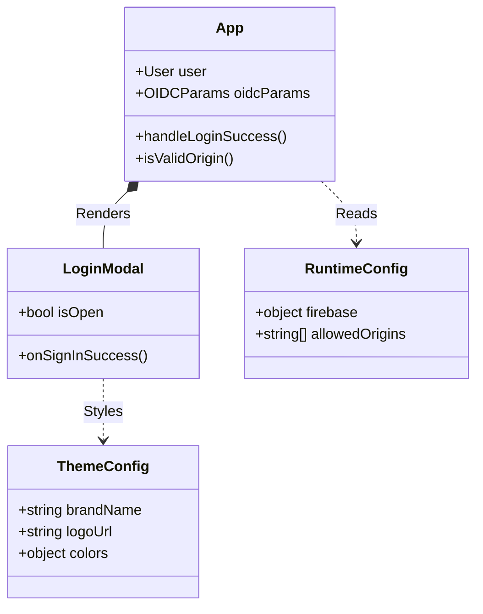
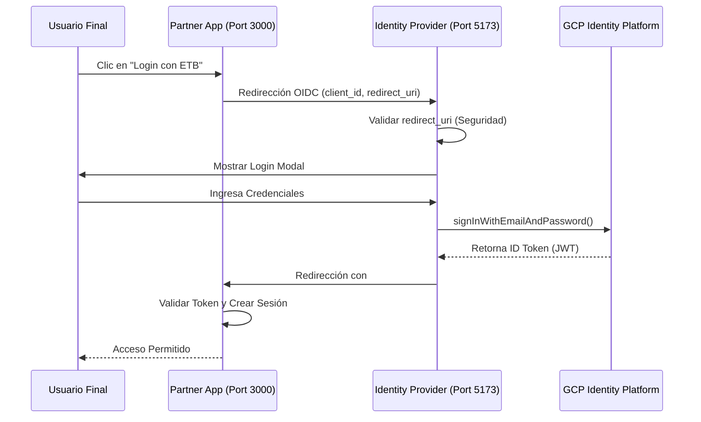
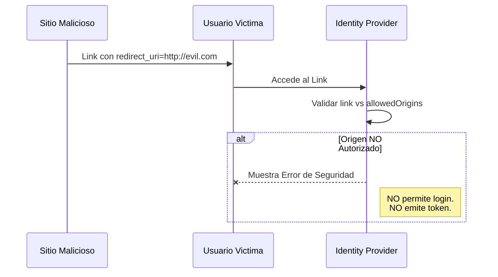
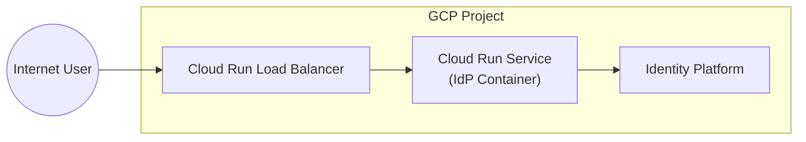
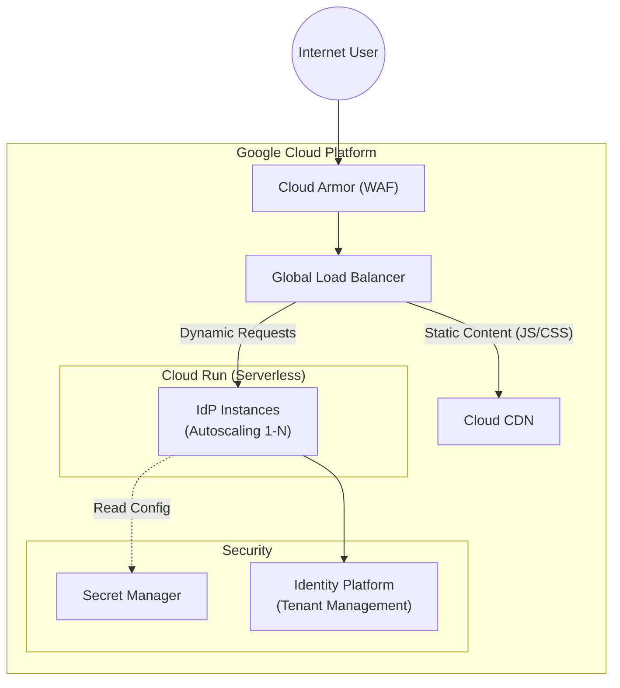

# 📘 Technical Documentation (TECH_README)

## 1. 🏗️ Arquitectura de la Solución

### Resumen
Esta solución es un **Identity Provider (IdP)** basado en OIDC (OpenID Connect), diseñado para ser **Stateless**, **Serverless** y **White-Label**. Actúa como una capa de abstracción de seguridad sobre **Firebase Authentication (GCP Identity Platform)**, permitiendo que múltiples aplicaciones (Partners) autentiquen usuarios sin manejar credenciales directamente.

### Principios de Diseño
*   **Identity Broker:** Centraliza la autenticación. Los clientes (Relying Parties) solo ven el IdP, nunca la base de datos de usuarios.
*   **Frontend-Only Security:** La aplicación es una SPA (React) que maneja flujos OIDC implícitos o PKCE. No almacena secretos de servidor (Client Secrets) en el código.
*   **Runtime Configuration:** La configuración se inyecta en tiempo de ejecución (`window.APP_CONFIG`), permitiendo que el mismo artefacto (Docker Image) sirva a múltiples inquilinos o entornos solo cambiando el archivo `config.js` o variables de entorno.

## 2. 🧩 Diagramas de Clases (Componentes)

Muestra la relación entre los componentes principales de React y la configuración.

> **Nota de Sintaxis Mermaid:**
> Para garantizar la compatibilidad estricta del parser y prevenir errores de renderizado, este documento extiende las directivas del *Diagramming Framework* implementando **Sanitización de Literales**. Los nodos con texto complejo (saltos de línea ` `, paréntesis) se encapsulan en comillas dobles/backticks, y los caracteres reservados en conectores se escapan con entidades HTML (e.g., `&lpar;` para `(`, `&rpar;` para `)`).

## 3. 🔄 Diagramas de Secuencia (Casos de Uso)

### A. Flujo de Autenticación OIDC (Happy Path)
El usuario llega desde una App de un Socio (Partner) y se autentica exitosamente.

### B. Intento de Phishing / Redirección No Autorizada (Seguridad)
Un atacante intenta engañar al usuario para que se loguee y enviar el token a un sitio malicioso.

## 4. ☁️ Arquitectura de Despliegue en Nube

### A. Mínima Viable (MVP / Dev)
Despliegue directo en **Cloud Run**. SSL gestionado automáticamente por Google.

### B. Recomendada (Producción / Enterprise)
Arquitectura robusta con **Cloud CDN** para assets estáticos y **Cloud Armor** (WAF) para protección contra ataques (DDoS, SQLi, XSS).  

## 5. 🛡️ Guía de Seguridad y Buenas Prácticas

1.  **Whitelisting:** Nunca despliegues a producción sin configurar exhaustivamente `APP_CONFIG.allowedOrigins`. Cualquier origen no listado será bloqueado.
2.  **Tokens:** El IdP emite tokens de corta duración (1 hora). La renovación debe manejarse en el cliente (silent refresh) o re-autenticando.
3.  **Logs:** No loguear información personal (PII) ni tokens en la consola del navegador ni en los logs de Cloud Run.
