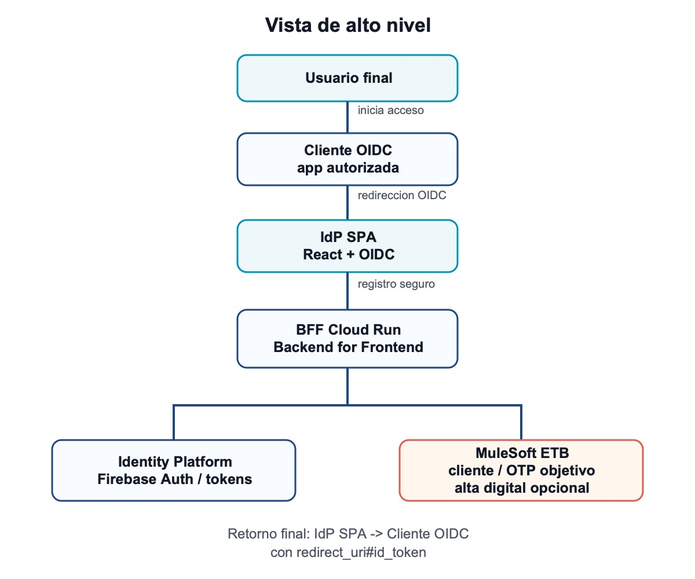
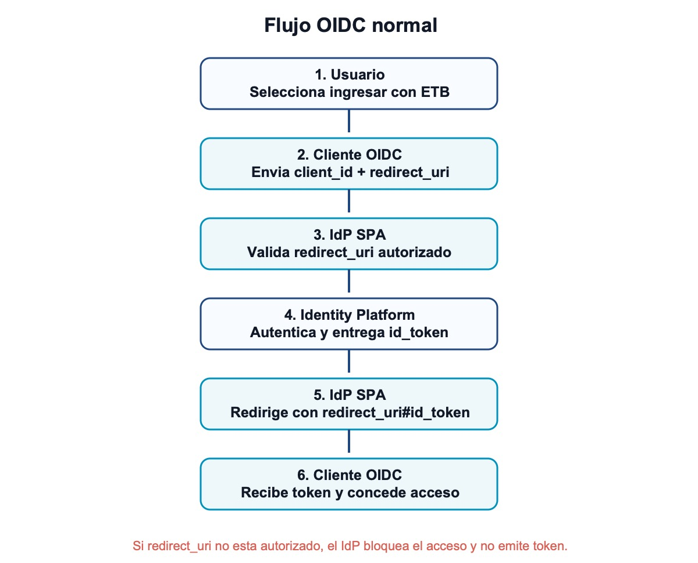
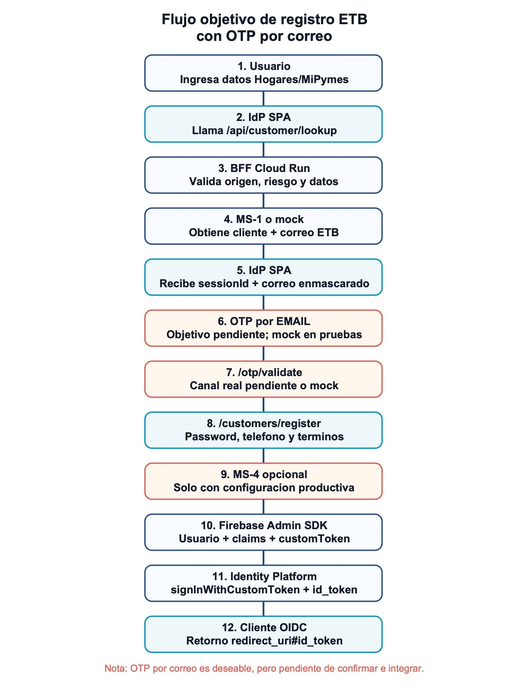
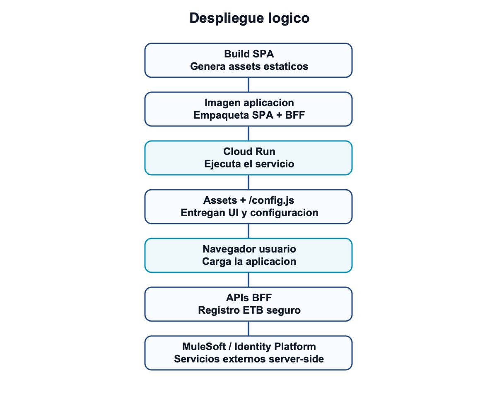

# Documento técnico de arquitectura de la aplicación

Fecha de corte: 2026-05-28.

## 1. Propósito

La aplicación es un **Identity Provider OIDC white-label** para centralizar el acceso de usuarios a aplicaciones cliente autorizadas. Opera como broker de identidad: las aplicaciones consumidoras redirigen al usuario al IdP, el IdP autentica o registra al usuario y luego retorna un `id_token` al cliente mediante **OIDC Implicit Flow**.

El contrato externo actual se mantiene así:

- Aplicación cliente envía `client_id`, `redirect_uri`, `response_type=id_token`, `state` y opcionalmente `nonce` o `prompt=none`.
- El IdP valida que el `redirect_uri` esté autorizado.
- Si la autenticación es exitosa, el usuario vuelve al cliente con `redirect_uri#id_token=...`.
- Si no hay sesión o hay error, vuelve con `redirect_uri#error=...`.

## 2. Vista de alto nivel

| Paso | Origen | Interacción | Destino |
| --- | --- | --- | --- |
| 1 | Usuario final | Inicia acceso | Aplicación cliente OIDC |
| 2 | Aplicación cliente OIDC | Redirección OIDC con `client_id` y `redirect_uri` | IdP SPA |
| 3 | IdP SPA | Login, sesión e `id_token` | Identity Platform |
| 4 | IdP SPA | Registro ETB / OTP objetivo | BFF Cloud Run (Backend for Frontend) |
| 5 | BFF Cloud Run (Backend for Frontend) | Consulta cliente, OTP por correo pendiente y alta digital opcional | MuleSoft ETB |
| 6 | BFF Cloud Run (Backend for Frontend) | Admin SDK, usuario, claims y custom token | Identity Platform |
| 7 | IdP SPA | Retorno `redirect_uri#id_token` | Aplicación cliente OIDC |

## 3. Capas de la solución

| Capa | Responsabilidad principal |
| --- | --- |
| SPA IdP | Presenta la experiencia de login/registro, valida la solicitud OIDC, maneja sesión Firebase y redirige al cliente con token o error. |
| BFF (Backend for Frontend) | Backend diseñado para servir específicamente a la SPA. Protege operaciones sensibles de registro, integra MuleSoft, valida reCAPTCHA, aplica límites de abuso y usa Firebase Admin SDK. |
| Identity Platform | Mantiene usuarios, sesión de navegador, proveedores sociales, email link, password reset e ID tokens. |
| MuleSoft | Valida cliente ETB y, como objetivo pendiente, debería permitir envío y validación de OTP por correo electrónico. La viabilidad del OTP por correo aún debe confirmarse con los servicios disponibles. |
| Configuración runtime | Publica configuración segura para Firebase, orígenes autorizados, URL canónica, reCAPTCHA y flags funcionales. La marca puede venir de `APP_CONFIG.theme` o de los valores por defecto del build. |

## 4. Estructura funcional

| Zona | Componente | Responsabilidad | Se conecta con |
| --- | --- | --- | --- |
| Navegador | Access gate OIDC | Valida `client_id`, `redirect_uri` y orígenes permitidos antes de mostrar login funcional. | Configuración runtime, login, registro. |
| Navegador | Login | Email link, social login, recuperación y renovación silenciosa. | Identity Platform, retorno OIDC. |
| Navegador | Registro ETB | Captura datos Hogares/MiPymes y consume APIs BFF. | Lookup, OTP objetivo, completar registro, Identity Platform. |
| Navegador | `APP_CONFIG` | Publica marca, Firebase, `allowedOrigins`, URL canónica y flags seguros. | Access gate, Firebase, UI. |
| Navegador | Retorno OIDC | Devuelve `#id_token` o `#error` a la aplicación cliente autorizada. | Aplicación cliente OIDC. |
| Servidor | `/config.js` | Entrega configuración runtime segura. | SPA. |
| Servidor | Seguridad transversal | CORS, headers, rate limit, validación de origen y límites antiabuso. | Todas las APIs sensibles. |
| Servidor | Lookup cliente | Consulta cliente/elegibilidad y crea sesión temporal. | MuleSoft MS-1 o mock, reCAPTCHA, sesión temporal. |
| Servidor | OTP por correo objetivo | Rutas preparadas para envío y validación OTP. | MuleSoft/canal pendiente o mock. |
| Servidor | Completar registro | Valida `verificationToken`, ejecuta MS-4 si aplica y crea identidad. | MuleSoft MS-4, Firebase Admin SDK. |
| Servicios externos | Identity Platform | Sesión, email link, social login, recuperación, `id_token`. | SPA y Firebase Admin SDK. |
| Servicios externos | Firebase Admin SDK | Crear usuario, claims y custom token. | BFF, Identity Platform. |
| Servicios externos | reCAPTCHA Enterprise | Evaluación de riesgo para lookup y envío OTP objetivo. | BFF. |
| Servicios externos | MuleSoft | Consulta cliente, OTP objetivo y alta digital opcional. | BFF. |

## Glosario breve de siglas

| Sigla | Significado | En esta aplicación |
| --- | --- | --- |
| BFF | Backend for Frontend | Backend que atiende a la SPA y concentra operaciones que no deben ejecutarse en navegador, como MuleSoft, OTP objetivo, reCAPTCHA server-side y Firebase Admin SDK. |
| SPA | Single Page Application | Aplicación web React que corre en el navegador y maneja la experiencia de login/registro. |
| IdP | Identity Provider | Proveedor de identidad que autentica usuarios y emite/retorna tokens al cliente OIDC. |
| OIDC | OpenID Connect | Protocolo usado para entregar identidad al cliente mediante `id_token`. |
| OTP | One-Time Password | Código de un solo uso. En este documento el canal deseable es correo electrónico, pendiente de confirmar e integrar productivamente. |
| SDK | Software Development Kit | Librería oficial usada para integrar Firebase en frontend y Admin SDK en backend. |

## 5. Métodos de autenticación y acceso

| Método | Descripción | Resultado |
| --- | --- | --- |
| Email link / passwordless | El usuario ingresa su correo y recibe un enlace seguro. Al abrirlo, Firebase completa la autenticación. | El IdP emite `id_token` al cliente autorizado. |
| Login social | Autenticación con Google, Apple o Facebook. Si Firebase marca el usuario como nuevo, se cierra la sesión temporal y se deriva al registro ETB. | Usuarios sociales existentes continúan; usuarios nuevos deben registrarse antes de emitir acceso. |
| Recuperación de contraseña | Envía un enlace para restablecer contraseña cuando el correo existe. | El usuario actualiza credenciales sin exponer si el correo existe o no. |
| Renovación silenciosa | El cliente solicita `prompt=none`. Si hay sesión Firebase activa, el IdP devuelve un token nuevo. | `id_token` nuevo o `error=login_required`. |
| Registro ETB con OTP por correo | Es el flujo objetivo para validar el registro usando el correo registrado en ETB. Hoy debe tratarse como capacidad pendiente de confirmar e integrar; el BFF tiene rutas y modo mock para simular el flujo. | Cuando sea viable, deberá producir custom token, sesión Firebase y posterior `id_token` OIDC. |

### Flujo deseable: Registro ETB con OTP por correo

Este es el flujo objetivo para validar el registro usando el correo registrado en ETB.

Hoy debe tratarse como una **capacidad pendiente de confirmar e integrar**. El BFF tiene rutas y modo mock para simular el flujo, pero todavía no confirma que el envío y la validación real de OTP por correo sean viables en producción.

Cuando sea viable, deberá producir:

- `customToken` emitido por Firebase Admin SDK;
- sesión Firebase iniciada desde la SPA;
- `id_token` OIDC posterior para retornar a la aplicación cliente autorizada.

## 6. APIs del BFF

Estas APIs se utilizan principalmente para el **registro ETB seguro**. El login OIDC normal se resuelve desde la SPA con Identity Platform; en cambio, el registro necesita un backend porque debe consultar información de cliente, proteger datos personales, validar riesgos, simular o integrar OTP por correo, y crear la identidad con Firebase Admin SDK.

El BFF actúa como una capa segura entre la SPA y los servicios internos. La SPA nunca debe llamar directamente a MuleSoft ni usar credenciales administrativas. Por eso, las APIs del BFF reciben datos mínimos desde el navegador, validan la solicitud y ejecutan del lado servidor las operaciones sensibles del registro.

Todas las rutas sensibles del BFF validan el origen del navegador cuando el entorno exige orígenes permitidos. Además, las rutas de consulta y OTP aplican rate limit. El BFF no expone al navegador credenciales MuleSoft, bearer tokens ni credenciales de Firebase Admin SDK.

Resumen de uso:

| Tipo de API | Rutas | Uso principal |
| --- | --- | --- |
| Configuración | `/config.js` | Entregar configuración pública para que la SPA sepa cómo operar. |
| Seguridad/observabilidad | `/api/security/csp-report` | Recibir reportes de seguridad del navegador. |
| Registro ETB | `/api/customer/lookup`, `/api/customer/otp/send`, `/api/customer/otp/validate`, `/api/customers/register` | Validar cliente, preparar OTP por correo objetivo, completar registro y crear sesión segura. |
| Operación | `/api/health` | Verificar que el servicio está vivo. |

| Método | Ruta | Propósito |
| --- | --- | --- |
| `GET` | `/config.js` | Publica configuración runtime segura para la SPA. |
| `POST` | `/api/security/csp-report` | Recibe reportes de política CSP cuando está habilitado. |
| `POST` | `/api/customer/lookup` | Consulta cliente/elegibilidad y crea una sesión temporal de registro. |
| `POST` | `/api/customer/otp/send` | Ruta preparada para envío OTP. Hoy puede simular el envío en modo mock; el envío real por correo depende de confirmar el servicio/canal viable. |
| `POST` | `/api/customer/otp/validate` | Ruta preparada para validación OTP. Hoy puede aceptar códigos mock en simulación; la validación real por correo depende de confirmar el servicio/canal viable. |
| `POST` | `/api/customers/register` | Completa registro, ejecuta MS-4 solo si está habilitado y correctamente configurado, crea/actualiza usuario, asigna claims y devuelve custom token. |
| `GET` | `/api/health` | Health check del servicio. |

### 6.1 `GET /config.js`

Publica el objeto runtime que consume la SPA antes de iniciar React.

| Aspecto | Detalle |
| --- | --- |
| Entrada | No requiere body. Lee variables de entorno del servicio. |
| Publica | Modo de aplicación, URL canónica del IdP, orígenes permitidos, configuración pública de Firebase, site key pública de reCAPTCHA y flags funcionales. |
| No publica | Secretos MuleSoft, bearer tokens, service account keys, claves privadas ni credenciales de Admin SDK. |
| Uso en frontend | Permite validar `redirect_uri`, inicializar Firebase y activar/desactivar comportamientos como exigir contexto OIDC. |
| Estado actual | Implementado. La marca visual puede venir de `APP_CONFIG.theme` cuando se inyecta en runtime o de valores por defecto del build. |

### 6.2 `POST /api/security/csp-report`

Recibe reportes de Content Security Policy cuando el modo report-only está habilitado.

| Aspecto | Detalle |
| --- | --- |
| Entrada | Reporte CSP en formato `application/csp-report`, `application/reports+json`, `application/json` o texto plano. |
| Procesamiento | Normaliza campos como documento, recurso bloqueado, directiva violada y disposición. |
| Respuesta | `204 No Content`. |
| Propósito | Observabilidad de seguridad para detectar recursos bloqueados o posibles violaciones de política. |
| Estado actual | Implementado como recolección de reportes en logs. |

### 6.3 `POST /api/customer/lookup`

Inicia el registro validando identidad del cliente y creando una sesión temporal.

| Aspecto | Detalle |
| --- | --- |
| Entrada Hogares | `customerType`, `docType`, `docNumber`, `recaptchaToken`. |
| Entrada MiPymes | `customerType`, `companyDocType`, `companyDocNumber`, `repDocType`, `repDocNumber`, `lastName`, `recaptchaToken`. |
| Validaciones | Tipo y número de documento, campos obligatorios, bloqueo por intentos OTP, límite por documento, rate limit, reCAPTCHA y origen permitido. |
| Integración real | Consulta MS-1 para obtener cliente, correo registrado y elegibilidad. |
| Modo mock | Si falta URL/credenciales MuleSoft o la URL indica mock, simula cliente elegible y correo `cliente...@etb.com.co`. |
| Sesión | Crea `sessionId` en memoria con TTL, correo real protegido, correo enmascarado, identidad normalizada, `correlationId` y estado `INITIATED`. |
| Respuesta exitosa | `sessionId` y `maskedEmail`. No devuelve correo real. |
| Errores relevantes | `400` datos incompletos, `403` reCAPTCHA/elegibilidad, `404` cliente no encontrado, `422` correo inválido, `423` bloqueo OTP, `429` abuso por identificación, `500` error servidor. |

### 6.4 `POST /api/customer/otp/send`

Ruta preparada para enviar OTP al correo registrado. Productivamente, el canal real por correo aún debe confirmarse.

| Aspecto | Detalle |
| --- | --- |
| Entrada | `sessionId`, `recaptchaToken`. |
| Validaciones | Sesión existente, sesión no expirada, usuario no bloqueado, reCAPTCHA, rate limit y origen permitido. |
| Canal previsto | `EMAIL`, usando el correo real guardado en la sesión del BFF. El navegador nunca elige ni recibe el correo completo. |
| Integración objetivo | Servicio MuleSoft/corporativo equivalente que envíe OTP por correo y devuelva `id_transaccion` o equivalente. |
| Modo mock | Simula envío, genera `SIM_TX_...`, no envía correo real. |
| Estado de sesión | Guarda `otpTransactionId` y cambia estado a `OTP_SENT`. |
| Respuesta exitosa | `success: true` y mensaje funcional. |
| Punto pendiente | Confirmar si MuleSoft o un servicio corporativo puede enviar OTP por correo con expiración, reintentos, bloqueo y trazabilidad. |

### 6.5 `POST /api/customer/otp/validate`

Ruta preparada para validar el código OTP. Productivamente, la validación real por correo aún debe confirmarse.

| Aspecto | Detalle |
| --- | --- |
| Entrada | `sessionId`, `code`. El código debe tener 6 dígitos. |
| Validaciones | Sesión existente, sesión no expirada, usuario no bloqueado, formato de código, rate limit y origen permitido. |
| Integración objetivo | Servicio MuleSoft/corporativo equivalente que valide `id_transaccion`, canal `EMAIL` y código ingresado. |
| Modo mock | Acepta códigos de prueba `123456` o `654321`. |
| Control de intentos | En fallo registra intento, reduce intentos restantes y puede bloquear temporalmente la identidad. |
| Respuesta exitosa | `success: true`, `verificationToken`, `maskedEmail` y mensaje funcional. |
| Seguridad | El `verificationToken` se guarda hasheado en la sesión, es de un solo uso y tiene TTL corto. |

### 6.6 `POST /api/customers/register`

Completa el registro después de una validación OTP vigente.

| Aspecto | Detalle |
| --- | --- |
| Entrada | `sessionId`, `verificationToken`, `password`, `phoneNumber`, `acceptTerms`, `acceptDataPolicy`. |
| Validaciones | Contraseña fuerte, teléfono válido, términos aceptados, sesión vigente, OTP verificado, `verificationToken` válido/no usado y elegibilidad vigente. |
| MS-4 | Solo se ejecuta si `MULESOFT_ENABLE_MS4=true` y existe configuración productiva. Si está habilitado pero falta configuración o está en mock, se rechaza el registro. |
| Firebase Admin SDK | Busca usuario por correo; si no existe, lo crea con correo verificado y contraseña. Luego asigna custom claims y crea custom token. |
| Claims actuales | Tipo de cliente, documento, hash de documento, fuente de registro `mulesoft_otp`, nivel `otp_verified`; MiPymes agrega datos de empresa. |
| Respuesta exitosa | `success: true` y `customToken`. La SPA usa ese token para iniciar sesión y luego emitir el `id_token` OIDC al cliente. |
| Limpieza | Marca el token de verificación como usado, cambia estado a `REGISTERED` y elimina la sesión temporal. |

### 6.7 `GET /api/health`

Endpoint simple de salud del servicio.

| Aspecto | Detalle |
| --- | --- |
| Entrada | No requiere body. |
| Respuesta | Texto plano indicando que el host del IdP está activo. |
| Uso | Verificación básica para operación, monitoreo o smoke test. |
| Alcance | No valida dependencias externas como MuleSoft, reCAPTCHA o Identity Platform. |

## 7. Flujo OIDC normal

| Paso | Actor | Acción | Resultado |
| --- | --- | --- | --- |
| 1 | Usuario | Selecciona ingresar con ETB desde la aplicación cliente. | La aplicación cliente inicia redirección OIDC. |
| 2 | Cliente OIDC | Envía `client_id`, `redirect_uri`, `response_type=id_token` y `state`. | El usuario llega al IdP SPA. |
| 3 | IdP SPA | Valida `redirect_uri` contra `allowedOrigins`. | Si no está autorizado, bloquea acceso. |
| 4 | IdP SPA | Si la solicitud es válida, muestra métodos de acceso. | Usuario puede autenticarse. |
| 5 | Usuario | Completa autenticación por email link, social login u otro flujo soportado. | La SPA obtiene usuario autenticado. |
| 6 | IdP SPA | Solicita token a Identity Platform. | Identity Platform devuelve `id_token`. |
| 7 | IdP SPA | Redirige al cliente. | Cliente recibe `redirect_uri#id_token=...&state=...`. |

## 8. Flujo de renovación silenciosa

| Paso | Actor | Acción | Resultado |
| --- | --- | --- | --- |
| 1 | Cliente OIDC | Envía solicitud OIDC con `prompt=none`. | El IdP interpreta renovación silenciosa. |
| 2 | IdP SPA | Valida `redirect_uri`. | Continúa solo si el origen está autorizado. |
| 3 | IdP SPA | Revisa sesión activa en Identity Platform. | Determina si hay usuario autenticado. |
| 4A | Identity Platform | Si hay sesión, emite nuevo token. | El IdP retorna `redirect_uri#id_token=...`. |
| 4B | IdP SPA | Si no hay sesión, responde error controlado. | El cliente recibe `redirect_uri#error=login_required`. |

## 9. Flujo objetivo de registro ETB con OTP por correo electrónico

El OTP por correo electrónico es el **flujo objetivo**, pero su implementación real aún debe confirmarse. La intención funcional es usar el correo registrado que retorna MuleSoft para el cliente ETB y mostrar en la interfaz solo una versión enmascarada. No se debe plantear OTP por SMS/celular porque no se cuenta con datos móviles actualizados y confiables de todos los clientes.

El código actual tiene rutas del BFF y modo mock para simular MS-1, MS-2 y MS-3, pero eso no confirma que el envío/validación real de OTP por correo esté disponible en producción. Antes de considerarlo implementado se debe validar si MuleSoft o un servicio corporativo puede:

- enviar OTP al correo registrado del cliente;
- devolver un identificador de transacción;
- validar el código ingresado por el usuario;
- garantizar expiración, reintentos, bloqueo, trazabilidad y auditoría.

El número de teléfono se solicita después como dato de contacto del registro. No debe usarse como canal OTP.

| Paso | Actor | Acción | Resultado |
| --- | --- | --- | --- |
| 1 | Usuario | Ingresa datos de Hogares o MiPymes. | La SPA prepara consulta de cliente. |
| 2 | IdP SPA | Ejecuta reCAPTCHA para lookup. | Obtiene token de riesgo si está configurado. |
| 3 | IdP SPA | Llama `/api/customer/lookup`. | El BFF recibe datos de identidad. |
| 4 | BFF | Valida origen, rate limit, datos y reCAPTCHA. | Rechaza solicitudes inválidas o abusivas. |
| 5 | BFF | Consulta MS-1 o modo mock. | Obtiene cliente, correo registrado y elegibilidad. |
| 6 | BFF | Crea sesión temporal. | Devuelve `sessionId` y correo enmascarado. |
| 7 | IdP SPA | Llama `/api/customer/otp/send`. | El BFF intenta envío OTP objetivo o simula en mock. |
| 8 | MuleSoft/canal pendiente | Envío OTP por EMAIL si el canal existe. | Devuelve `id_transaccion` o error funcional. |
| 9 | Usuario | Ingresa código OTP. | La SPA prepara validación. |
| 10 | IdP SPA | Llama `/api/customer/otp/validate`. | El BFF valida con canal pendiente o mock. |
| 11 | BFF | Si el OTP es válido, emite `verificationToken`. | La SPA puede continuar registro. |
| 12 | Usuario | Define contraseña, teléfono de contacto y acepta términos. | La SPA prepara cierre de registro. |
| 13 | IdP SPA | Llama `/api/customers/register`. | El BFF valida sesión y `verificationToken`. |
| 14 | BFF | Ejecuta MS-4 solo si está habilitado y con configuración productiva. | Alta digital confirmada o error funcional. |
| 15 | BFF | Usa Firebase Admin SDK para crear/actualizar usuario, claims y custom token. | Devuelve `customToken`. |
| 16 | IdP SPA | Ejecuta `signInWithCustomToken`. | Identity Platform inicia sesión Firebase. |
| 17 | IdP SPA | Retorna al cliente autorizado. | Cliente recibe `redirect_uri#id_token=...`. |

## 10. Integraciones principales

### Identity Platform

Se usa para autenticar usuarios, mantener sesión en navegador, emitir ID tokens, ejecutar email link, login social, recuperación de contraseña y completar sesión con custom token después del registro.

### Firebase Admin SDK

Solo opera desde el BFF. Permite crear o buscar usuarios, marcar correos como verificados, asignar custom claims y emitir custom tokens. No debe ejecutarse desde navegador.

### MuleSoft

La SPA nunca llama MuleSoft directamente. En modo real, el BFF obtiene un bearer token server-side y ejecuta:

| Servicio | Función |
| --- | --- |
| MS-1 | Consulta cliente, correo registrado y elegibilidad. |
| MS-2 / canal equivalente | Objetivo pendiente: enviar OTP por correo electrónico al correo registrado. |
| MS-3 / canal equivalente | Objetivo pendiente: validar el código OTP enviado por correo. |
| MS-4 | Ejecuta alta digital antes de crear identidad, solo cuando está habilitado y tiene configuración productiva. |

Si faltan las URLs o credenciales MuleSoft, el BFF entra en modo mock para MS-1/MS-2/MS-3. Este modo sirve para pruebas del flujo, pero no demuestra que OTP por correo sea viable productivamente. MS-4 no se ejecuta en modo mock cuando el feature flag está habilitado; en ese caso el registro se rechaza por configuración incompleta.

### reCAPTCHA Enterprise

Protege acciones sensibles del registro, principalmente consulta de cliente y el flujo objetivo de envío OTP. Si no está configurado en entornos de simulación, el flujo puede usar validación mock.

### Configuración runtime

La aplicación usa configuración runtime para publicar únicamente valores seguros. La configuración generada por el servidor publica principalmente:

- Firebase público: `apiKey`, `authDomain`, `projectId`.
- Orígenes permitidos para `redirect_uri`.
- URL canónica del IdP.
- Site key público de reCAPTCHA.
- Flags funcionales no secretos.

La marca visual puede venir de `APP_CONFIG.theme` cuando se inyecta en runtime, o de los valores ETB por defecto incluidos en el build.

No se deben publicar secretos MuleSoft, bearer tokens, service account keys, credenciales de Admin SDK ni claves privadas.

## 11. Seguridad

| Control | Aplicación |
| --- | --- |
| Validación de `redirect_uri` | Solo se permite retornar tokens a orígenes configurados. |
| Bloqueo temprano | Si la solicitud OIDC es inválida, no se renderiza login funcional. |
| Parámetros OIDC seguros | Se bloquean nombres reservados y valores no permitidos en parámetros adicionales. |
| CORS y origen server-side | Las rutas sensibles validan origen además de CORS. |
| Rate limit | Se limitan consultas de cliente, envío OTP y validación OTP en las rutas preparadas. |
| Protección contra abuso por documento | Se bloquean consultas repetidas y demasiados intentos OTP, incluyendo simulación/mock. |
| Protección de PII | El correo real permanece en servidor; el navegador recibe correo enmascarado. |
| Sesiones temporales | `sessionId` y `verificationToken` tienen TTL y uso limitado. |
| Headers de seguridad | Se aplican controles como `nosniff`, `no-referrer`, `Permissions-Policy`, HSTS y CSP report-only opcional. |
| Secretos | Permanecen en servidor o Secret Manager, nunca en la configuración pública. |

## 12. Despliegue lógico

| Paso | Componente | Entrega / consume |
| --- | --- | --- |
| 1 | Build de SPA | Genera assets estáticos. |
| 2 | Imagen de aplicación | Empaqueta SPA y BFF. |
| 3 | Cloud Run | Ejecuta el servicio. |
| 4 | Runtime config | Sirve configuración pública para el navegador. |
| 5 | Assets estáticos | Entregan la interfaz React al navegador. |
| 6 | APIs BFF | Atienden registro, lookup, OTP objetivo y cierre de registro. |
| 7 | MuleSoft | Consume llamadas server-side desde el BFF. |
| 8 | Identity Platform | Atiende autenticación, sesión, tokens y Admin SDK. |
| 9 | Navegador | Carga assets/config y consume APIs BFF según el flujo. |

## 13. Estado actual y evolución

| Tema | Estado actual | Evolución esperada |
| --- | --- | --- |
| Contrato OIDC | SPA stateless con Implicit Flow. | Mantener salvo decisión formal de arquitectura. |
| BFF | Servicio central para APIs de registro y hosting de la SPA. | Modularizar si crece la lógica de MuleSoft, auditoría y operación. |
| OTP por correo | Objetivo pendiente. El código tiene rutas y modo mock, pero falta confirmar viabilidad del canal real de envío/validación por correo. | Integración real con servicio corporativo/MuleSoft, persistencia con TTL, auditoría e idempotencia. |
| Auditoría | Logs y correlation id. | Evidencia persistente de aceptación, eventos y trazabilidad. |
| MS-4 | Feature flag y contrato sujeto a configuración productiva; no opera en modo mock cuando está habilitado. | Contrato definitivo y obligatorio si negocio exige alta digital previa. |
| Elegibilidad | Depende de indicador confiable de MuleSoft o modo mock local. | Campo/servicio oficial de elegibilidad validado por negocio. |

## 14. Operación end-to-end

1. El cliente OIDC redirige al usuario al IdP.
2. El IdP valida `client_id`, `redirect_uri` y orígenes permitidos.
3. El usuario inicia sesión o se registra.
4. Para login existente, Firebase entrega sesión e ID token.
5. Para registro, el BFF hoy puede simular la validación OTP en modo mock; el flujo productivo esperado requiere confirmar e integrar OTP por correo electrónico.
6. La SPA obtiene un ID token válido.
7. El IdP retorna al cliente con `id_token` o con un error OIDC controlado.
