# Arquitectura IdP GCP + MuleSoft + OTP ETB

Fecha de corte: 2026-05-07.

Este documento define la arquitectura objetivo para integrar el IdP SPA del repo con GCP Identity Platform y los servicios MuleSoft existentes de ETB. Complementa `docs/architecture/TECH_README.md` y mantiene la decisión actual del producto: IdP SPA stateless con OIDC Implicit Flow hacia los clientes OIDC.

Decision formal: [ADR 0001 - IdP SPA Stateless + BFF Stateful Acotado](decisions/0001-idp-spa-stateless-bff-stateful.md). El BFF es stateful solo para MuleSoft, OTP, MS-4, auditoria y Admin SDK; no reemplaza el contrato OIDC stateless del IdP hacia los Relying Parties.

## Mapa Visual Rápido

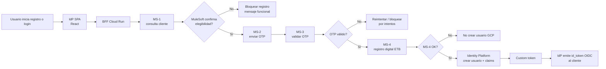

## Decisión De Elegibilidad Pendiente

No usar `customer.services[].state.state` como fuente de verdad para decidir si el cliente tiene servicios activos. Ese dato no es fidedigno para el registro.

La elegibilidad debe venir de MuleSoft mediante un campo o servicio explícito, por ejemplo:

- `eligibleForDigitalRegistration: true`
- `hasActiveServices: true`
- `registrationEligibility.status: "ELIGIBLE"`
- o un MS dedicado de elegibilidad/registro validado por negocio.

Notas:

- No se usa `customer.state === "ACTIVO"` como condición bloqueante de elegibilidad.
- No se usa `services[].state.state === "Activo"` como condición bloqueante ni habilitante.
- Hasta que MuleSoft entregue un indicador fidedigno, el BFF no debe crear usuario en Identity Platform en producción.
- El correo de OTP debe salir de `customer.contactData.email` entregado por MuleSoft. En producción el usuario no debe poder elegir otro correo para recibir OTP.

### Diagrama De Decisión

```mermaid
flowchart TD
  START([Respuesta MS-1]) --> A{customer[] tiene<br/>al menos un cliente?}
  A -- No --> NOCLIENTE[No encontrado<br/>bloquear]
  A -- Sí --> B{contactData.email<br/>existe?}
  B -- No --> NOCORREO[Sin correo registrado<br/>bloquear]
  B -- Sí --> C{Campo fidedigno<br/>de elegibilidad?}
  C -- No --> PENDIENTE[Contrato MuleSoft pendiente<br/>no inferir desde services]
  C -- Sí --> D{Elegible?}
  D -- No --> NOACTIVO[No elegible<br/>bloquear]
  D -- Sí --> OK[Elegible<br/>continuar OTP]
```

## Decisión MiPymes

Para MiPymes la validación se realiza con NIT de empresa y representante legal:

- La UI captura `NIT` de empresa y tipo/número de documento del representante legal antes de solicitar OTP.
- El BFF envía a MS-1 el documento del representante legal como identidad principal (`CUSTOMER_ID_TYPE` y `CUSTOMER_ID`) y adjunta el NIT de empresa como dato de validación/auditoría según el contrato MuleSoft vigente.
- La elegibilidad se evalúa con el indicador fidedigno que MuleSoft defina; no se infiere desde `services[].state.state`.
- El NIT y el documento del representante quedan congelados en la sesión del BFF. Después de OTP no se permite cambiarlos ni registrar con valores reenviados desde el navegador.
- Los claims deben distinguir el segmento con `customer_type: "MiPymes"` cuando MS-1 retorne ese segmento o cuando la ruta UI seleccionada sea MiPymes y el BFF lo confirme.

## Servicios Existentes

| Servicio | Endpoint QA | Uso |
| --- | --- | --- |
| MS-1 consulta cliente | `GET https://customer-xapi-services-QA.us-e2.cloudhub.io:443/v1/customer` | Retorna `customer[]`, datos de contacto, `segment` y `services[]`. |
| MS-2 genera/envía OTP | `POST https://mule-worker-internal-experience-xapi-services-QA.us-e2.cloudhub.io:8082/operations/v1/customer/otp` | Envía OTP al correo registrado y retorna `id_transaccion`. |
| MS-3 valida OTP | `POST https://experience-xapi-services-QA.us-e2.cloudhub.io:443/operations/v1customer/otp/validation` | Valida `id_transaccion` + código OTP. |
| MS-4 registra cliente digital | Pendiente de definición MuleSoft | Debe registrar la aceptación/alta digital en sistemas ETB antes de crear o habilitar el usuario en Identity Platform. |

Los secretos MuleSoft (`client_id`, `client_secret`, bearer JWT) deben vivir en Secret Manager. No deben viajar al navegador ni a `public/config.js`.

## Servicio Pendiente MS-4

MS-4 es bloqueante para producción si ETB necesita registrar al cliente en sistemas internos antes de crear la identidad GCP. El orden correcto es:

1. MS-1 o un servicio equivalente retorna un indicador fidedigno de elegibilidad.
2. MS-2 envía OTP al correo registrado.
3. MS-3 valida OTP.
4. MS-4 registra el alta digital/cliente en ETB.
5. BFF crea/actualiza el usuario en Identity Platform.
6. BFF emite custom token para que el IdP complete el OIDC redirect.

Contrato recomendado para MS-4:

```json
{
  "aplicacion": "silice",
  "id_transaccion_otp": "<id_transaccion de MS-2>",
  "tipo_cliente": "HOGARES|MIPYMES",
  "tipo_documento": "CC",
  "numero_documento": "9774689",
  "correo_registrado": "cliente@dominio.com",
  "acepta_terminos": true,
  "version_terminos": "v1.0",
  "acepta_tratamiento_datos": true,
  "version_tratamiento_datos": "v1.0",
  "proveedor_identidad": "GCP_IDENTITY_PLATFORM",
  "correlation_id": "BFF-..."
}
```

Respuesta recomendada:

```json
{
  "codigo": "200",
  "id_registro": "REG-...",
  "estado": "REGISTRADO"
}
```

Si MS-4 falla, el BFF no debe crear el usuario en Identity Platform. Si ya existía un usuario previo, no debe emitir custom token hasta resolver el estado ETB.

### Posición De MS-4 En El Camino Crítico

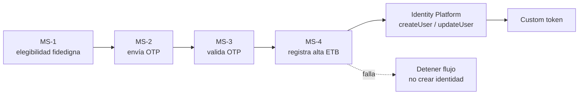

## Componentes Objetivo

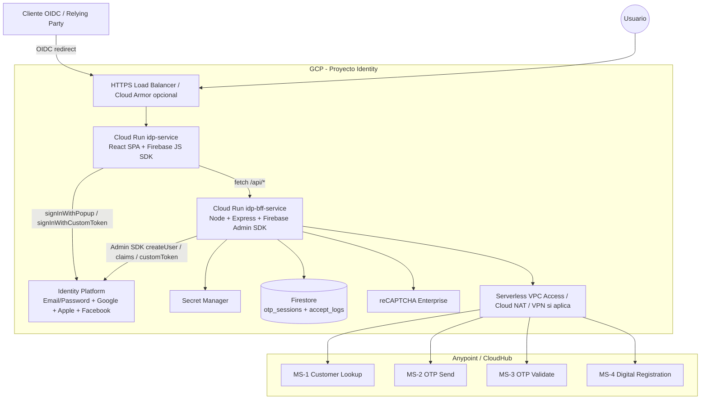

## Límites De Confianza

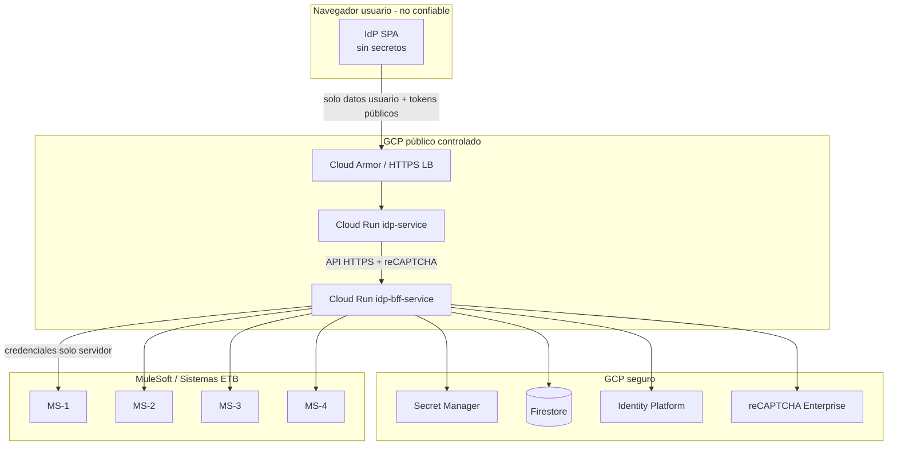

## Estados Del Registro

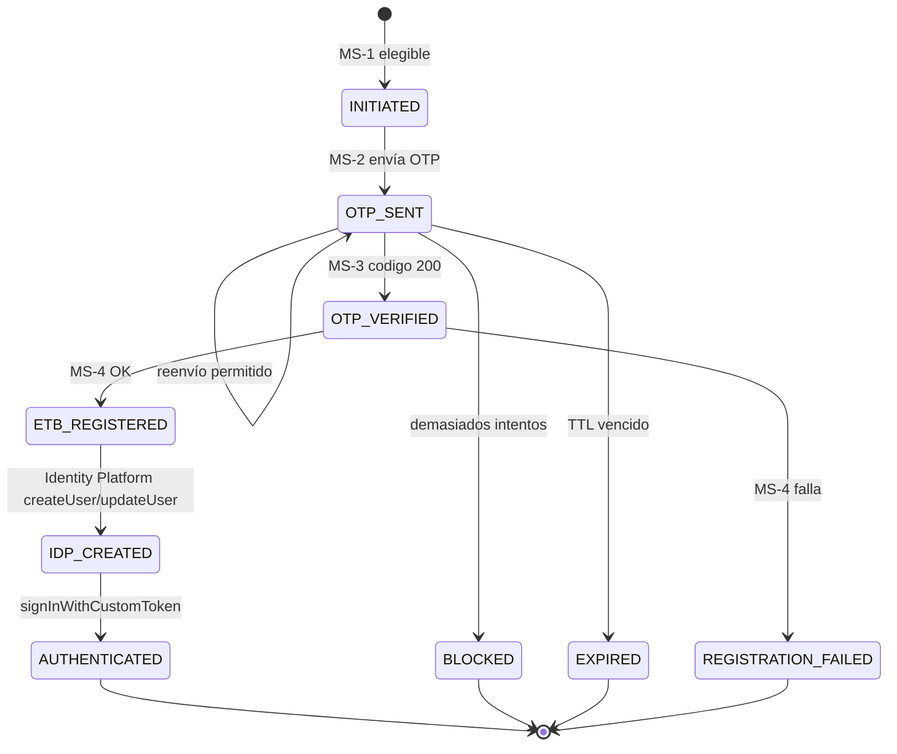

## Flujo Registro Hogares

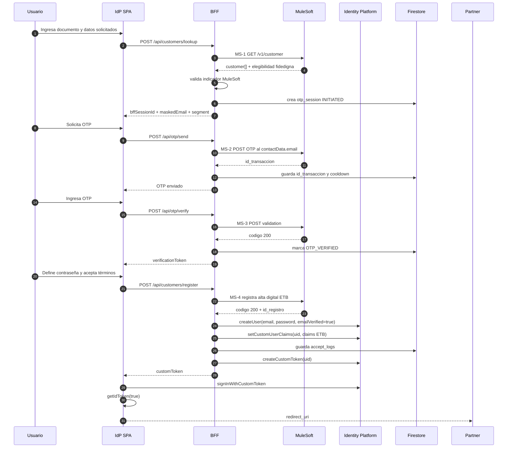

## Flujo Registro MiPymes Por Representante Legal

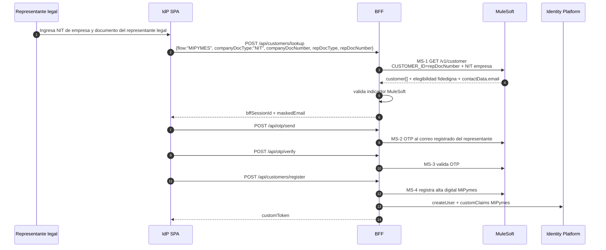

## Flujo Social Login Controlado

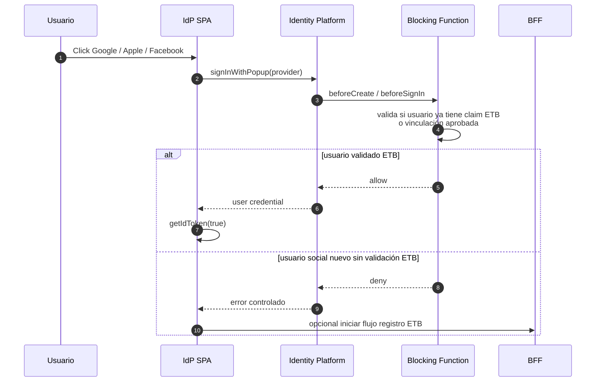

## Flujo Login Email Link

El login principal de la pantalla IdP usa funcionalidades de GCP Identity Platform/Firebase Auth. MuleSoft MS-2/MS-3 queda para validacion ETB de registro/alta digital, no para autenticar usuarios existentes desde esta pantalla.

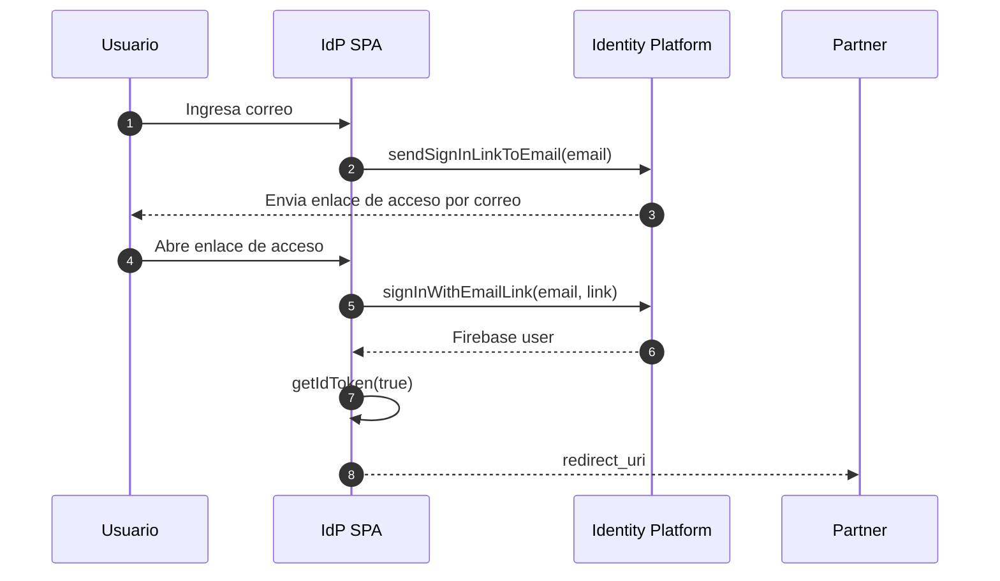

## Recuperación De Contraseña Administrada Por GCP

La recuperación de contraseña se mantiene en Identity Platform para usuarios con proveedor Email/Password:

- Decisión MVP: el IdP solicita el reset con Firebase JS SDK (`sendPasswordResetEmail`).
- GCP genera el action code seguro.
- El usuario recibe un enlace de recuperación.
- El enlace abre el handler autorizado de Identity Platform, por ejemplo `https://<IDP_DOMAIN>/__/auth/action`.
- El usuario define nueva contraseña y luego vuelve al IdP para autenticarse.

La opción enterprise con BFF/Admin SDK (`generatePasswordResetLink`) queda como alternativa futura si Seguridad/Operación exige auditoría central, rate limit server-side o envío de correo corporativo ETB.

Los dominios QA/PROD del IdP y del BFF aún no están definidos. Para QA pueden usarse temporalmente las URLs públicas de Cloud Run; para PROD deben existir dominios corporativos confirmados antes de configurar providers sociales, authorized domains, CORS, reCAPTCHA y pruebas E2E productivas.

### Diagrama Recuperación MVP

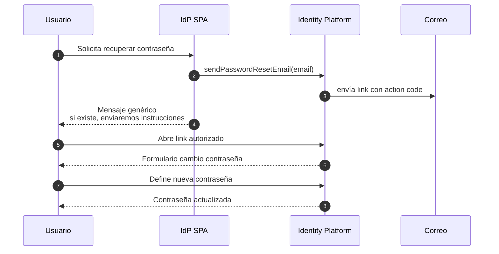

### Diagrama Recuperación Enterprise

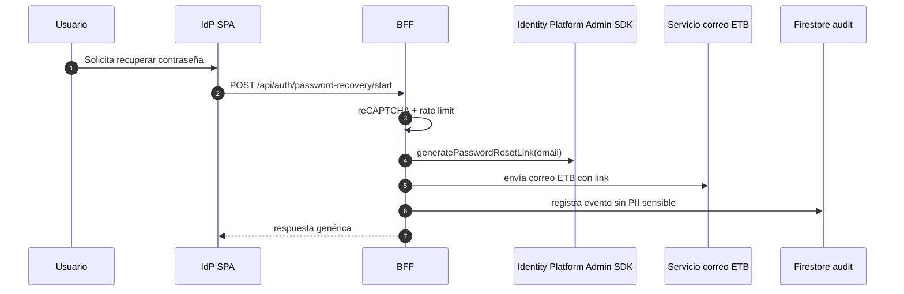

## Claims Recomendados

Los claims se establecen desde BFF con Admin SDK, nunca desde el navegador:

```json
{
  "customer_type": "Hogares",
  "etb_customer_id": "9774689",
  "doc_type": "CC",
  "doc_number_hash": "sha256:<hash>",
  "registration_eligible": true,
  "registration_source": "mulesoft_otp",
  "auth_level": "otp_verified"
}
```

No incluir dirección, fecha de nacimiento, teléfono completo, correo completo ni datos de servicio detallados dentro del ID token.

## Controles De Seguridad

- BFF obligatorio para MuleSoft y Admin SDK.
- Secret Manager para credenciales MuleSoft y JWT internos.
- Rate limit por IP, documento, correo y sesión.
- Firestore para `otp_sessions` con TTL lógico.
- `verificationToken` de BFF de un solo uso, TTL máximo 10 minutos.
- reCAPTCHA Enterprise antes de `lookup`, `otp/send` y recuperación.
- Blocking Function `beforeCreate`/`beforeSignIn` para impedir altas sociales sin validación ETB.
- Logs sin OTP, contraseñas, tokens, correo completo, dirección ni documento completo.

## Matriz Visual De Responsabilidades

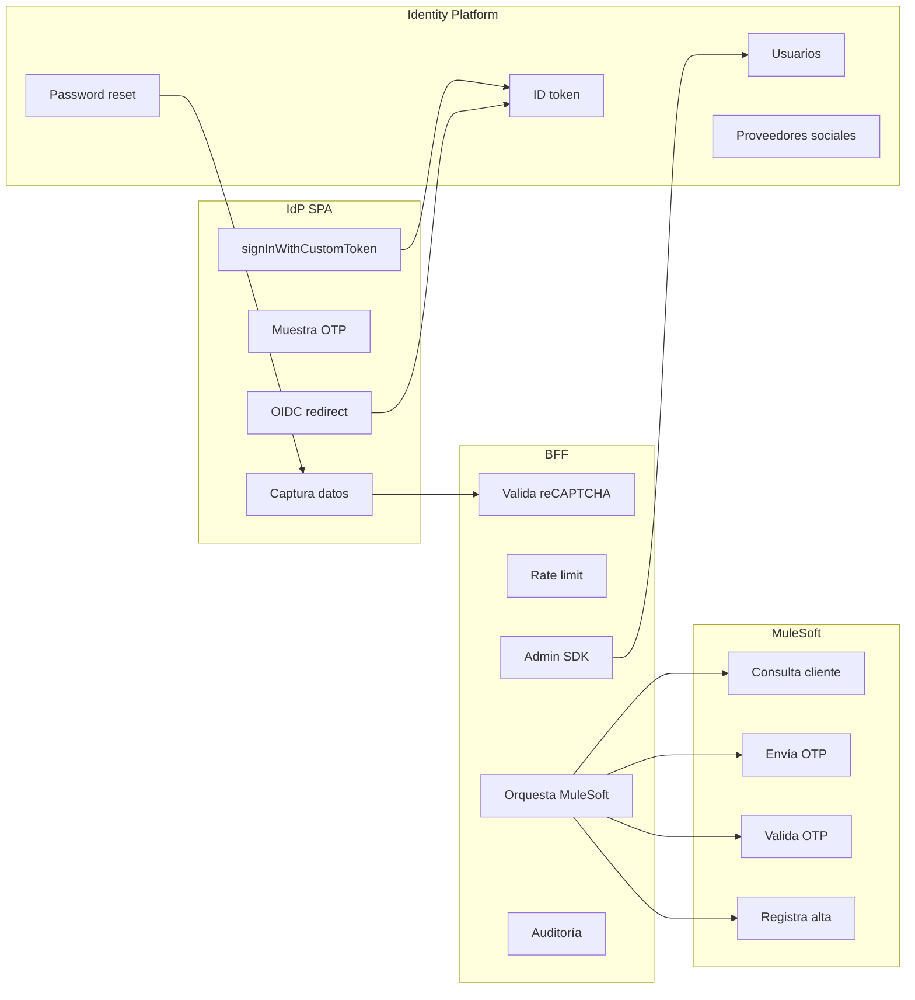

## Fuentes Oficiales

- Identity Platform custom tokens: https://cloud.google.com/identity-platform/docs/admin/create-custom-tokens
- Identity Platform blocking functions: https://cloud.google.com/identity-platform/docs/blocking-functions
- Google provider: https://cloud.google.com/identity-platform/docs/web/google
- Facebook provider: https://cloud.google.com/identity-platform/docs/web/facebook
- Apple provider: https://cloud.google.com/identity-platform/docs/web/apple
- Cloud Run VPC connectors: https://cloud.google.com/run/docs/configuring/vpc-connectors
- Cloud Run secrets: https://cloud.google.com/run/docs/configuring/services/secrets
