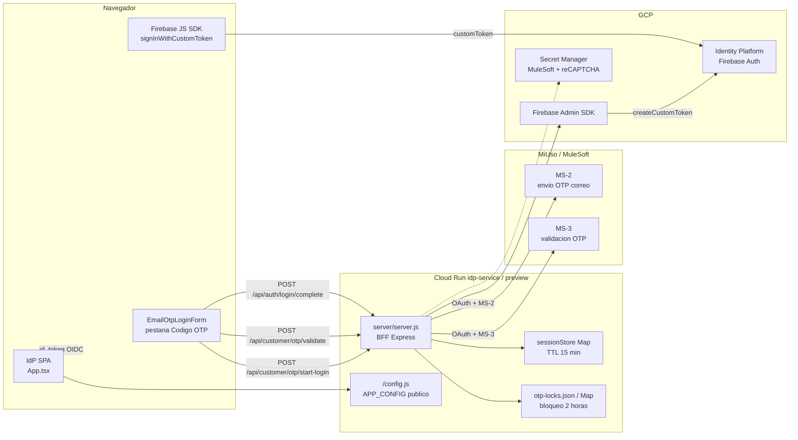
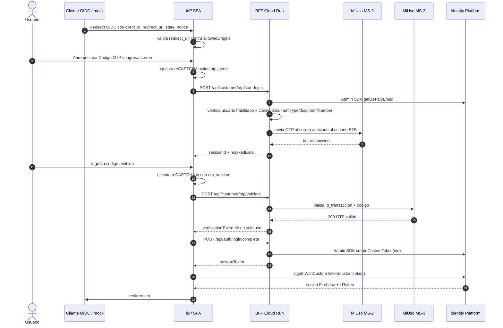

# Login OTP por correo con MiUso, MuleSoft e Identity Platform

Fecha de corte: 2026-05-31.

Este documento describe la implementacion vigente del login por OTP de correo en el IdP. Complementa [TECH_README.md](TECH_README.md), [IDP_MULESOFT_GCP_ARCHITECTURE.md](IDP_MULESOFT_GCP_ARCHITECTURE.md) y la decision [ADR 0001](decisions/0001-idp-spa-stateless-bff-stateful.md).

## Resumen

El IdP mantiene el contrato externo actual: SPA stateless con OIDC Implicit Flow hacia los clientes OIDC. La nueva pestaña `Codigo OTP` agrega un segundo metodo de login para usuarios ETB existentes y registrados en Identity Platform.

El navegador no llama a MuleSoft ni recibe secretos. La SPA llama al BFF del mismo Cloud Run, el BFF orquesta MiUso/MuleSoft MS-2 y MS-3, emite un `customToken` con Firebase Admin SDK, y la SPA ejecuta `signInWithCustomToken`. Desde ese punto el usuario queda autenticado en Firebase/Auth e Identity Platform, y el IdP completa el redirect OIDC con `id_token` como en los demas metodos de login.

## Estado implementado

| Capa | Archivo / servicio | Rol actual |
| --- | --- | --- |
| UI login OTP | `src/components/EmailOtpLoginForm.tsx` | Pestaña `Codigo OTP`, captura correo, envia codigo, valida OTP, deshabilita por bloqueo. |
| reCAPTCHA cliente | `src/utils/recaptcha.ts` | Ejecuta acciones `otp_send` y `otp_validate` usando `window.APP_CONFIG.recaptchaSiteKey`. |
| BFF OTP login | `server/server.js` | Endpoints `start-login`, `send`, `validate` y `login/complete`; rate limit, lockout, MuleSoft, Admin SDK. |
| MiUso / MuleSoft | MS-2 y MS-3 | MS-2 envia OTP por correo; MS-3 valida `id_transaccion` + codigo. |
| Identity Platform | Firebase Auth + Admin SDK | Admin SDK emite `customToken`; Firebase JS SDK inicia sesion real con `signInWithCustomToken`. |
| OIDC | `src/App.tsx` | Toma la sesion Firebase y emite `redirect_uri#id_token=...&state=...`. |

## Diagrama de componentes



## Secuencia happy path



## Endpoints implementados

| Endpoint | Uso | Seguridad aplicada |
| --- | --- | --- |
| `POST /api/customer/otp/start-login` | Inicia login OTP para correo existente y habilitado. Responde generico para evitar enumeracion. | `Origin/Referer`, rate limit envio, reCAPTCHA `otp_send`, lockout por correo, Admin SDK lookup. |
| `POST /api/customer/otp/send` | Reenvia OTP de una sesion login valida. | `Origin/Referer`, rate limit envio, reCAPTCHA `otp_send`, lockout. |
| `POST /api/customer/otp/validate` | Valida codigo contra MS-3. | `Origin/Referer`, rate limit global y por sesion, reCAPTCHA `otp_validate`, maximo de intentos, lockout 2 horas. |
| `POST /api/auth/login/complete` | Intercambia `verificationToken` por `customToken`. | `Origin/Referer`, rate limit, token de verificacion hash, un solo uso, TTL 10 min, Admin SDK. |

## Validacion de identidad y no enumeracion

1. El BFF normaliza el correo y busca el usuario con Admin SDK.
2. Solo son elegibles usuarios no deshabilitados que tengan custom claims `documentType` y `documentNumber`.
3. Si el usuario no existe o no es elegible, el BFF crea una sesion sombra y responde como si el inicio hubiera sido aceptado.
4. La sesion sombra no llama MS-2 y cualquier OTP ingresado falla de forma indistinguible.
5. El correo completo, documento, OTP, tokens y secretos no se devuelven al navegador ni se escriben en logs.

## Registro real en Identity Platform

El login OTP queda registrado como autenticacion real porque la SPA ejecuta `signInWithCustomToken` con un token emitido por Firebase Admin SDK para el `uid` existente.

El `customToken` incluye claims adicionales de login:

```json
{
  "auth_level": "otp_email_verified",
  "login_method": "miuso_email_otp"
}
```

Despues de `signInWithCustomToken`, Firebase/Auth emite los tokens normales (`idToken` / secure token). Los reportes de Identity Platform ven una autenticacion contra el usuario real, no una simulacion del BFF.

## Controles antiabuso

- `reCAPTCHA Enterprise` en envio y validacion: acciones `otp_send` y `otp_validate`.
- `express-rate-limit` por IP para envio y validacion.
- Rate limit por `sessionId` para validacion de OTP.
- Maximo de intentos por sesion (`OTP_MAX_ATTEMPTS`, por defecto 3).
- Bloqueo de 2 horas por identidad/correo (`OTP_LOCK_MS`).
- Persistencia local de bloqueos en `tmp/otp-locks.json` para sobrevivir reinicios dentro del mismo servicio.
- Respuestas genericas para evitar enumeracion de cuentas.
- Guard server-side de `Origin` / `Referer` contra `CORS_ALLOWED_ORIGINS`.
- `/config.js` bloquea patrones de secretos y solo publica identificadores publicos necesarios.

## Configuracion GCP requerida

| Componente | Requisito |
| --- | --- |
| Cloud Run service account | `idp-service-sa` necesita leer Secret Manager y tener permiso para firmar custom tokens. En el preview se uso `roles/iam.serviceAccountTokenCreator` sobre la propia service account para resolver `iam.serviceAccounts.signBlob`. |
| Identity Platform authorized domains | Agregar cada dominio del IdP sin protocolo, por ejemplo `idp-service-otp-preview-2tczqvffra-ue.a.run.app`. |
| Firebase Web API key | Restringida a `identitytoolkit.googleapis.com` y `securetoken.googleapis.com`; agregar HTTP referrers del IdP con variante exacta y `/*` cuando aplique. |
| reCAPTCHA web key | Agregar dominios del IdP que ejecutan `grecaptcha`, incluyendo previews temporales solo en QA. |
| Secret Manager | Montar secretos MuleSoft y reCAPTCHA solo en Cloud Run; nunca en `public/config.js` ni bundle cliente. |
| Cloud Run preview | El preview aislado usa `idp-service-otp-preview` y `mock-client-otp-preview` para no afectar `idp-service`. |

## Estado de sesion actual

La implementacion actual usa `Map` en memoria para `sessionStore` con TTL de 15 minutos. Esto esta alineado con el alcance actual validado para una instancia/preview y con la decision operativa de no introducir Firestore en este cambio. La arquitectura enterprise documenta Firestore como evolucion posible para multi-instancia, auditoria fuerte o alta disponibilidad.

## Prueba manual recomendada

1. Abrir el mock cliente o construir URL OIDC hacia el IdP preview.
2. Seleccionar `Codigo OTP`.
3. Ingresar un correo registrado y habilitado.
4. Esperar el correo mas reciente de MiUso/ETB.
5. Ingresar ese OTP en la misma sesion.
6. Confirmar redirect al mock con `id_token`.
7. En logs de Cloud Run confirmar:
   - `mulesoft.ms2.response` con `status=200`.
   - `mulesoft.ms3.response` con `status=200`.
   - `login.otp.success`.
   - Sin `Error issuing login custom token`.

## Errores operativos conocidos

| Sintoma | Causa probable | Mitigacion |
| --- | --- | --- |
| `Verificacion de seguridad fallida` | Dominio no autorizado en reCAPTCHA o token reCAPTCHA ausente. | Agregar dominio a la web key y validar `recaptchaSiteKey` en `/config.js`. |
| `Requests from referer ... are blocked` | API key Firebase sin HTTP referrer del Cloud Run. | Agregar referrer exacto y/o `/*` a la API key web. |
| `UNAUTHORIZED_DOMAIN` | Dominio no esta en Identity Platform authorized domains. | Agregar dominio sin protocolo en Identity Platform. |
| `No fue posible completar el inicio de sesion` despues de OTP valido | Admin SDK no puede emitir `customToken`, normalmente falta `iam.serviceAccounts.signBlob`. | Conceder permiso minimo a la service account usada por Cloud Run. |
| OTP correcto aparece como invalido | Codigo corresponde a otra sesion o correo anterior; MS-3 valida contra `id_transaccion`. | Solicitar nuevo codigo y usar el correo mas reciente para esa misma sesion. |
