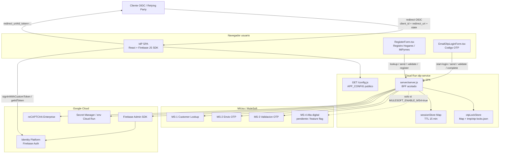
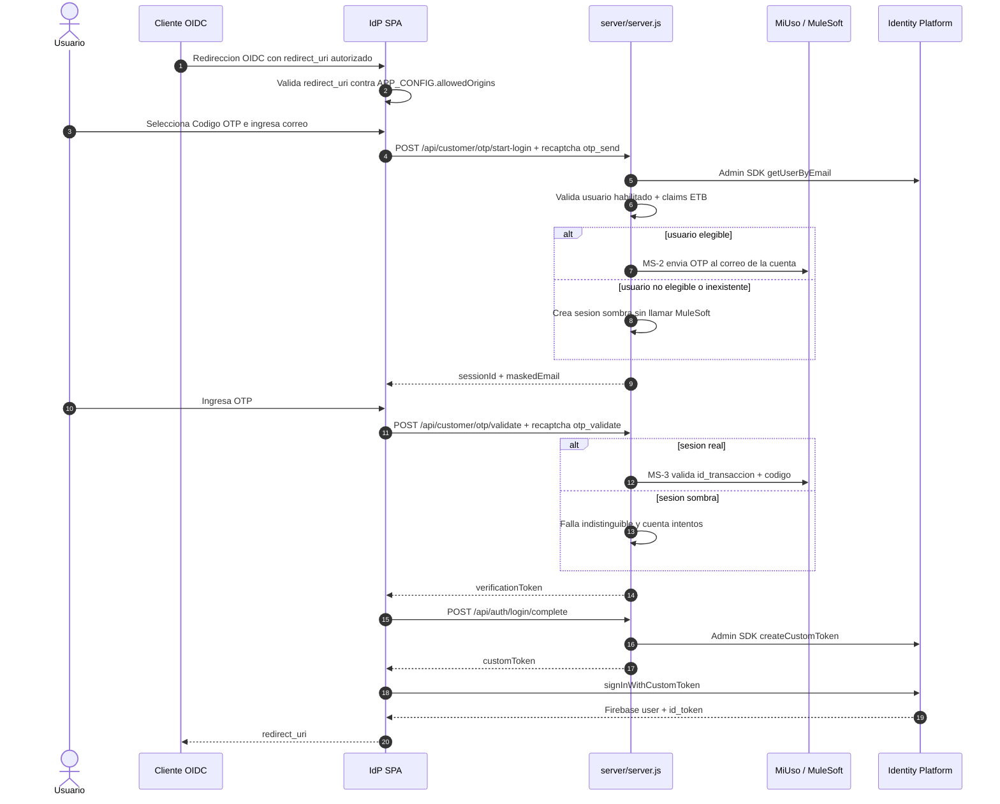
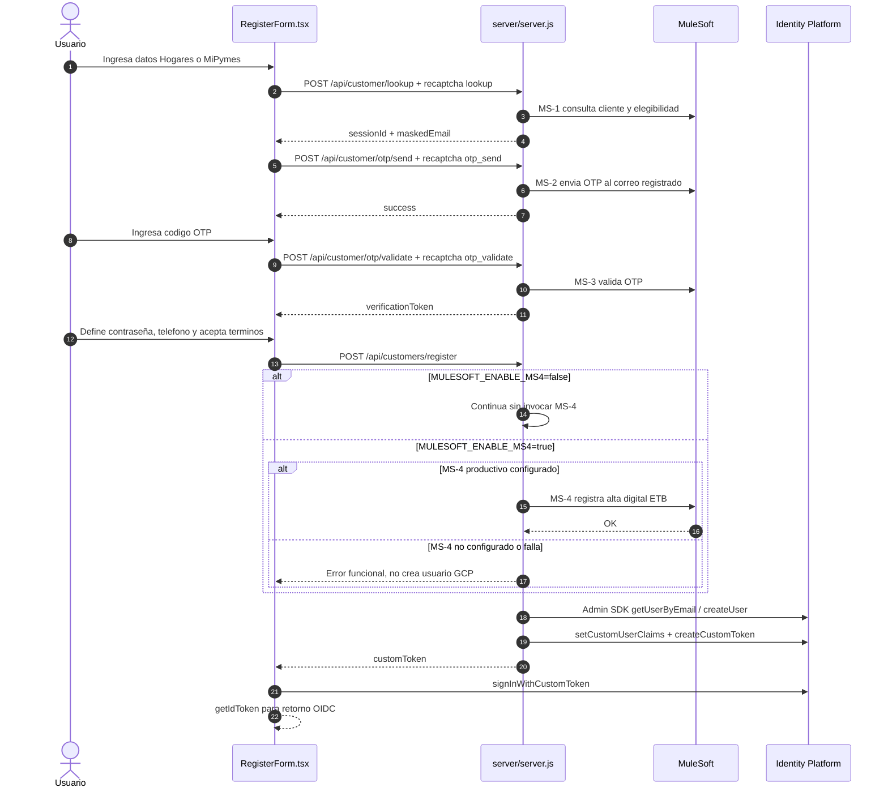
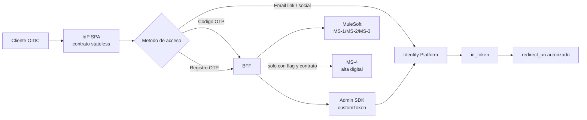

# Validacion de arquitectura OTP, BFF y MS-4

Fecha de corte: 2026-05-31.

Este documento valida la arquitectura OTP actual contra el codigo vigente y consolida los diagramas necesarios para entender la diferencia entre:

- lo implementado hoy en `server/server.js`, `src/App.tsx`, `src/components/RegisterForm.tsx` y `src/components/EmailOtpLoginForm.tsx`;
- la arquitectura objetivo enterprise documentada en [IDP_MULESOFT_GCP_ARCHITECTURE.md](IDP_MULESOFT_GCP_ARCHITECTURE.md);
- las decisiones vinculantes de [ADR 0001](decisions/0001-idp-spa-stateless-bff-stateful.md).

## Veredicto ejecutivo

La arquitectura actual de OTP esta alineada con el contrato principal del repositorio: el IdP sigue siendo una SPA stateless hacia clientes OIDC y conserva OIDC Implicit Flow. El BFF existe, pero esta acotado a operaciones que no deben vivir en navegador: MuleSoft, OTP, reCAPTCHA server-side, rate limit, sesiones temporales y Firebase Admin SDK.

La implementacion vigente no corresponde aun al objetivo enterprise completo. Hoy el BFF vive dentro del mismo proceso Express que sirve la SPA, usa `Map` en memoria para sesiones OTP y solo invoca MS-4 si `MULESOFT_ENABLE_MS4=true` y hay configuracion productiva. Firestore, auditoria persistente e `idp-bff-service` modular siguen siendo evolucion objetivo.

## Documentos revisados

| Documento | Estado frente al codigo | Observacion |
| --- | --- | --- |
| [TECH_README.md](TECH_README.md) | Vigente | Describe el contrato OIDC, login por email link, Codigo OTP, prompt none y despliegue. |
| [APPLICATION_ARCHITECTURE_OVERVIEW.md](APPLICATION_ARCHITECTURE_OVERVIEW.md) | Vigente | Es la vista mas clara para explicar capas, endpoints y operacion end-to-end. |
| [LOGIN_OTP_EMAIL_FLOW.md](LOGIN_OTP_EMAIL_FLOW.md) | Vigente | Es la fuente mas precisa del login Codigo OTP implementado. |
| [IDP_MULESOFT_GCP_ARCHITECTURE.md](IDP_MULESOFT_GCP_ARCHITECTURE.md) | Vigente con distincion importante | Mezcla implementacion actual y arquitectura objetivo; la seccion inicial marca bien la diferencia. |
| [decisions/0001-idp-spa-stateless-bff-stateful.md](decisions/0001-idp-spa-stateless-bff-stateful.md) | Vigente | Mantiene la regla clave: BFF stateful acotado, sin cambiar el contrato OIDC externo. |
| [../planning/IDP_GCP_MULESOFT_IMPLEMENTATION_PLAN.md](../planning/IDP_GCP_MULESOFT_IMPLEMENTATION_PLAN.md) | Parcialmente historico | Sigue util para evolucion enterprise, pero varias fases ya tienen implementacion monolitica actual. |
| [../planning/HU-MS4-REGISTRO-CLIENTE-IDP-GCP.md](../planning/HU-MS4-REGISTRO-CLIENTE-IDP-GCP.md) | Vigente como HU de MS-4 | Debe leerse como contrato pendiente del servicio MS-4, no como descripcion exacta de todo el codigo actual. |

## Arquitectura OTP actual

## Secuencia actual de login Codigo OTP

## Secuencia actual de registro OTP y MS-4

## Objetivo vs implementado hoy

| Tema | Implementado hoy | Objetivo enterprise |
| --- | --- | --- |
| Contrato OIDC externo | SPA stateless con `redirect_uri#id_token` | Igual, salvo nuevo ADR. |
| BFF | `server/server.js` en el mismo Cloud Run que sirve la SPA | Servicio modular `idp-bff-service`. |
| Sesiones OTP | `Map` en memoria con TTL 15 min | Firestore con TTL, auditoria e idempotencia. |
| Bloqueos OTP | `Map` + `tmp/otp-locks.json` | Persistencia central y trazabilidad operativa. |
| Login Codigo OTP | Implementado con MS-2/MS-3 + custom token | Mantener y endurecer operacion multi-instancia si aplica. |
| Registro OTP | Implementado con MS-1/MS-2/MS-3 + Admin SDK | Agregar MS-4 definitivo y auditoria persistente. |
| MS-4 | Feature flag `MULESOFT_ENABLE_MS4`; path provisional `/operations/v1/customer/register` | Contrato definitivo recomendado `POST /v1/digital-identity/registration`. |
| Auditoria | Logs sin PII sensible + correlation id | Firestore `accept_logs` / `registration_events`. |
| Elegibilidad | Campos fidedignos si MuleSoft los entrega; mock local en simulacion | Servicio/campo oficial aprobado por negocio, obligatorio en produccion. |

## Validacion contra codigo

| Punto validado | Evidencia en codigo |
| --- | --- |
| La SPA no llama MuleSoft directamente | `RegisterForm.tsx` y `EmailOtpLoginForm.tsx` usan `fetch('/api/...')`; MuleSoft solo aparece en `server/server.js`. |
| Login OTP usa usuario existente de Identity Platform | `/api/customer/otp/start-login` usa `admin.auth().getUserByEmail` y valida custom claims ETB. |
| Hay proteccion contra enumeracion | Login OTP crea sesiones sombra para usuarios no elegibles y responde de forma generica. |
| OTP usa MS-2 y MS-3 del lado servidor | `sendOtpViaMs2()` y `/api/customer/otp/validate` ejecutan llamadas server-side con bearer MuleSoft. |
| El cierre de login OTP es autenticacion real | `/api/auth/login/complete` emite `customToken`; la SPA ejecuta `signInWithCustomToken`. |
| Registro ya no crea usuario desde frontend | `RegisterForm.tsx` llama `/api/customers/register` y luego `signInWithCustomToken`. |
| MS-4 no esta activo por defecto | `/api/customers/register` solo invoca MS-4 si `MULESOFT_ENABLE_MS4 === 'true'`. |
| Si MS-4 esta habilitado sin configuracion valida, se bloquea | El endpoint devuelve `503` antes de crear o actualizar usuario. |
| Los secretos no se publican en `APP_CONFIG` | `/config.js` filtra patrones prohibidos antes de responder. |

## Brechas y decisiones pendientes

1. MS-4 definitivo sigue pendiente: debe confirmarse path, RAML, idempotencia, payload legal, respuesta exitosa y dueño del sistema de persistencia.
2. Produccion con alta digital previa requiere `MULESOFT_ENABLE_MS4=true` y una URL MS-4 real. Si ETB exige alta digital, no se debe ir a produccion con MS-4 apagado.
3. Firestore no esta implementado para sesiones OTP/auditoria. Para multi-instancia o evidencia fuerte, migrar `sessionStore` y eventos a almacenamiento central.
4. La elegibilidad de registro depende de un indicador fidedigno. No debe inferirse desde `services[].state.state`.
5. La HU de MS-4 conserva alcance de servicio nuevo; su narrativa debe mantenerse sincronizada con la realidad del BFF actual cuando cambie el contrato Anypoint.

## Resumen para explicar en una reunion

La idea clave: OTP no cambia el contrato OIDC del producto. Agrega una puerta servidor para validar identidad ETB con MuleSoft y convertir esa validacion en una sesion real de Identity Platform.
