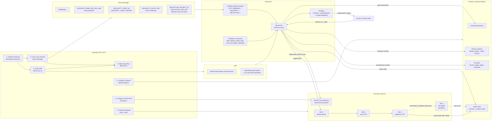

# Guia canonica de configuracion productiva GCP + Firebase

Fecha de corte: 2026-05-25.

Esta guia consolida la configuracion operativa de produccion para `idp-service` en Cloud Run, Firebase Auth / GCP Identity Platform, Secret Manager, MuleSoft y reCAPTCHA Enterprise.

Usar este documento como fuente principal para mitigar hallazgos de configuracion productiva. `DEPLOY.md` queda para pipeline/build; `CONFIGURACION-PASO-A-PASO.md` queda para desarrollo local y checklist general; `IDP_GCP_MULESOFT_MANUAL.md` queda como runbook amplio de proveedores sociales, MuleSoft y MS-4.

No escribir valores secretos reales en este repositorio, tickets, capturas ni chats. Los valores sensibles se crean o rotan directamente en Secret Manager.

## Diagrama intuitivo de configuraciones

Este diagrama muestra que se configura en cada plataforma y como llega a `idp-service` en Cloud Run. La lectura recomendada es de izquierda a derecha: primero se preparan secretos, permisos y proveedores; luego Cloud Run consume esa configuracion; finalmente el usuario ejecuta login/registro contra Firebase, MuleSoft y reCAPTCHA.



Checklist visual por bloque:

| Bloque | Que debe quedar correcto |
| --- | --- |
| Secret Manager | Secretos separados por variable; no usar un unico `MULESOFT_BASE_URL` para MS-1/MS-2/MS-3/MS-4. |
| IAM | `idp-service-sa` puede leer secretos y administrar usuarios Firebase/Auth segun el rol aprobado. |
| Cloud Run | Nueva revision de `idp-service` monta variables sensibles desde secretos y variables no secretas como texto normal. |
| Firebase / Identity Platform | Dominios autorizados, API key restringida y providers configurados segun ambiente. |
| reCAPTCHA | Site key para frontend y API key/proyecto para assessment backend. |
| MuleSoft | URLs reales y autenticacion real; sin modo mock ni bearer simulado. |

## 1. Estado validado en GCP

Validacion realizada por CLI contra:

| Campo | Valor observado |
| --- | --- |
| Proyecto GCP | `etb-identity-omnicanal` |
| Cuenta CLI | `leangars@etb.com.co` |
| Servicio Cloud Run | `idp-service` |
| Region | `us-east1` |
| Revision activa | `idp-service-00012-fsn` |
| URL activa | `https://idp-service-2tczqvffra-ue.a.run.app` |
| URL regional | `https://idp-service-296091754258.us-east1.run.app` |
| Service account | `idp-service-sa@etb-identity-omnicanal.iam.gserviceaccount.com` |
| Estado Cloud Run | `Ready` |

Nota de despliegue 2026-05-25:

- `idp-service-00012-fsn` sirve 100% del trafico.
- `run.googleapis.com/invoker-iam-disabled=true`; el servicio permanece publico aunque la operacion de set IAM publico haya mostrado warning.
- Cloud Build requirio `roles/storage.objectViewer`, `roles/logging.logWriter` y `roles/artifactregistry.writer` para `296091754258-compute@developer.gserviceaccount.com`.
- El contenedor usa `node:22-alpine` porque `pnpm@11.2.2` requiere Node >= 22.13.
- `VITE_ALLOWED_ORIGINS` y `CORS_ALLOWED_ORIGINS` quedaron separados para distinguir retorno OIDC vs invocacion BFF.

APIs habilitadas observadas:

- `firebase.googleapis.com`
- `identitytoolkit.googleapis.com`
- `recaptchaenterprise.googleapis.com`
- `run.googleapis.com`
- `secretmanager.googleapis.com`

Secretos existentes observados:

- `FIREBASE_API_KEY`
- `FIREBASE_AUTH_DOMAIN`
- `FIREBASE_PROJECT_ID`
- `FIREBASE_SERVICE_ACCOUNT`
- `MULESOFT_BASE_URL`
- `MULESOFT_BASE_URL_MS1` (creado el 2026-05-25)
- `MULESOFT_BASE_URL_MS2` (creado el 2026-05-25)
- `MULESOFT_BASE_URL_MS3` (creado el 2026-05-25)
- `MULESOFT_CLIENT_ID`
- `MULESOFT_CLIENT_SECRET`
- `MULESOFT_OAUTH_URL` (creado el 2026-05-25)
- `MULESOFT_OAUTH_CLIENT_ID` (creado el 2026-05-25)
- `MULESOFT_OAUTH_CLIENT_SECRET` (creado el 2026-05-25)
- `MULESOFT_OAUTH_ACCOUNT_ID` (creado el 2026-05-25)
- `RECAPTCHA_PROJECT_ID` (creado el 2026-05-25)
- `RECAPTCHA_SITE_KEY`
- `RECAPTCHA_API_KEY` (creado el 2026-05-25; version 1 deshabilitada, version 2 vigente)

Hallazgos a mitigar:

| Hallazgo | Impacto | Mitigacion |
| --- | --- | --- |
| `MULESOFT_BASE_URL_MS1`, `MS2`, `MS3` y `MS4` apuntaban al mismo secreto `MULESOFT_BASE_URL`. | Riesgo de llamar endpoints MuleSoft incorrectos. MS-1/MS-2/MS-3/MS-4 tienen bases y paths distintos. | Mitigado para MS-1/MS-2/MS-3 con secretos separados. MS-4 queda pendiente y desactivado. |
| Faltaba `MULESOFT_OAUTH_URL` o credenciales OAuth vigentes. | El backend no puede obtener el JWT dinamico requerido por MuleSoft. | Mitigado con `MULESOFT_OAUTH_URL` y credenciales OAuth separadas. No usar JWT ya emitidos copiados desde cURL. |
| Solo existia `RECAPTCHA_SITE_KEY`; faltaban `RECAPTCHA_PROJECT_ID` y `RECAPTCHA_API_KEY`. | El backend entra en bypass/simulacion de reCAPTCHA. | Mitigado: `RECAPTCHA_PROJECT_ID` y `RECAPTCHA_API_KEY` creados. Montarlos en Cloud Run con la nueva revision. |
| `idp-service-sa` no tenia rol Firebase/Auth admin. | Admin SDK puede fallar al crear usuarios, actualizar usuarios o setear custom claims. | Mitigado: `roles/firebaseauth.admin` otorgado el 2026-05-25. |
| Existe `FIREBASE_SERVICE_ACCOUNT`, pero Cloud Run no lo monta. | Puede crear confusion. En Cloud Run se debe preferir la service account adjunta, no JSON descargado. | No descargar JSON para prod. Usar `idp-service-sa` con IAM correcto. |
| `/config.js` no expone `recaptchaSiteKey` en la revision actual. | El frontend no recibe llave publica de reCAPTCHA desde runtime config. | Redeploy con imagen actual y validar `/config.js`. |
| El codigo actual inicializa Admin SDK solo si ve `GOOGLE_APPLICATION_CREDENTIALS` o `FIREBASE_CONFIG`. | En Cloud Run, la practica esperada es usar Application Default Credentials de la service account adjunta. | Ajustar codigo para inicializar Admin SDK en Cloud Run con ADC, o montar `FIREBASE_CONFIG` si Seguridad lo exige. |

## 2. Plan de trabajo recomendado

Ejecutar en este orden.

1. Congelar ventana de cambio.
   - Avisar que se creara una nueva revision de Cloud Run.
   - Confirmar si se hara por consola o CLI.
   - Guardar captura o export de la configuracion actual antes de cambiar.

2. Confirmar datos funcionales pendientes.
   - URL real de MS-1.
   - URL real de MS-2.
   - URL real de MS-3.
   - URL real de MS-4, solo para la fase posterior de alta digital.
   - Confirmar que el endpoint OAuth responde con `access_token` usando `client_credentials`.
   - No confundir un bearer ya emitido en un cURL con la URL de Get Token OAuth 2.0 ni guardarlo como configuracion.
   - Dominios definitivos del IdP y de clientes OIDC.

3. Crear secretos faltantes en Secret Manager.
   - No reemplazar `MULESOFT_BASE_URL`; crear secretos granulares.
   - No pegar secretos en variables de entorno de texto plano.

4. Ajustar IAM de `idp-service-sa`.
   - Mantener `roles/secretmanager.secretAccessor`.
   - Agregar rol Firebase/Auth aprobado.

5. Editar Cloud Run y desplegar nueva revision.
   - Mapear cada variable sensible desde Secret Manager.
   - Mantener `VITE_ALLOWED_ORIGINS` como variable no secreta.
   - Validar service account y region.

6. Configurar Firebase / Identity Platform / Google Auth Platform.
   - Authorized domains.
   - API key HTTP referrers.
   - OAuth web client origins y redirect URIs si aplica login social.

7. Configurar reCAPTCHA Enterprise.
   - Crear key web por ambiente.
   - Crear o restringir API key para assessments.
   - Montar `RECAPTCHA_PROJECT_ID`, `RECAPTCHA_SITE_KEY`, `RECAPTCHA_API_KEY`.

8. Redeploy de imagen si el codigo local ya corrige `/config.js` y Admin SDK.
   - Si no se redeploya codigo, los cambios de variables no corrigen la brecha de `/config.js`.

9. Validar sin exponer secretos.
   - Revisar env vars por nombre, no valores.
   - Revisar IAM.
   - Revisar `/config.js` enmascarando valores.
   - Ejecutar flujo de registro QA controlado.

10. Documentar cierre.
    - Fecha.
    - Revision desplegada.
    - Secret versions usadas.
    - Resultado de pruebas.
    - Rollback disponible.

## 3. Preparacion y respaldo antes del cambio

### 3.1. Validar proyecto y cuenta CLI

```bash
gcloud auth list --filter=status:ACTIVE --format='value(account)'
gcloud config get-value project
```

Esperado:

```text
leangars@etb.com.co
etb-identity-omnicanal
```

Si el proyecto no es el esperado:

```bash
gcloud config set project etb-identity-omnicanal
```

### 3.2. Exportar configuracion actual de Cloud Run

```bash
gcloud run services describe idp-service \
  --region=us-east1 \
  --project=etb-identity-omnicanal \
  --format=yaml > /tmp/idp-service-before.yaml
```

Este archivo puede contener nombres de secretos, variables no secretas y metadata. No deberia contener valores de secretos, pero tratarlo como interno.

### 3.3. Listar variables y secretos montados sin revelar valores

```bash
gcloud run services describe idp-service \
  --region=us-east1 \
  --project=etb-identity-omnicanal \
  --format='json(spec.template.spec.containers[0].env)' \
  | jq '.'
```

Si no tienes `jq`, usar:

```bash
gcloud run services describe idp-service \
  --region=us-east1 \
  --project=etb-identity-omnicanal \
  --format=json
```

## 4. Secret Manager

### 4.1. Secretos canonicos para `idp-service`

Usar estos Secret IDs en este repo. Evitar la variante anterior en minusculas para este servicio, salvo que exista una migracion acordada.

| Variable de entorno Cloud Run | Secret ID recomendado | Tipo | Estado esperado |
| --- | --- | --- | --- |
| `VITE_FIREBASE_API_KEY` | `FIREBASE_API_KEY` | Publicable pero restringida | Ya existe; mantener en Secret Manager para runtime. |
| `VITE_FIREBASE_AUTH_DOMAIN` | `FIREBASE_AUTH_DOMAIN` | Configuracion | Ya existe. |
| `VITE_FIREBASE_PROJECT_ID` | `FIREBASE_PROJECT_ID` | Configuracion | Ya existe. |
| `MULESOFT_BASE_URL_MS1` | `MULESOFT_BASE_URL_MS1` | Sensible operacional | Crear. |
| `MULESOFT_BASE_URL_MS2` | `MULESOFT_BASE_URL_MS2` | Sensible operacional | Crear. |
| `MULESOFT_BASE_URL_MS3` | `MULESOFT_BASE_URL_MS3` | Sensible operacional | Crear. |
| `MULESOFT_ENABLE_MS4` | No aplica | Feature flag | Variable no secreta; mantener `false` hasta recibir contrato MS-4. |
| `MULESOFT_BASE_URL_MS4` | `MULESOFT_BASE_URL_MS4` | Sensible operacional | No montar en la fase actual. Crear cuando MuleSoft entregue contrato. |
| `MULESOFT_CLIENT_ID` | `MULESOFT_CLIENT_ID` | Secreto | Ya existe; validar version. |
| `MULESOFT_CLIENT_SECRET` | `MULESOFT_CLIENT_SECRET` | Secreto | Ya existe; validar version/rotacion. |
| `MULESOFT_OAUTH_URL` | `MULESOFT_OAUTH_URL` | Configuracion sensible | Creado para OAuth client credentials. |
| `MULESOFT_OAUTH_CLIENT_ID` | `MULESOFT_OAUTH_CLIENT_ID` | Secreto | Creado; se envia en el body del servicio token. |
| `MULESOFT_OAUTH_CLIENT_SECRET` | `MULESOFT_OAUTH_CLIENT_SECRET` | Secreto | Creado; se envia en el body del servicio token. |
| `MULESOFT_OAUTH_ACCOUNT_ID` | `MULESOFT_OAUTH_ACCOUNT_ID` | Configuracion sensible | Creado; se envia como `account_id`. |
| `RECAPTCHA_PROJECT_ID` | `RECAPTCHA_PROJECT_ID` | Configuracion | Crear; valor usual: `etb-identity-omnicanal`. |
| `RECAPTCHA_SITE_KEY` | `RECAPTCHA_SITE_KEY` | Llave publica | Ya existe; validar dominio y ambiente. |
| `RECAPTCHA_API_KEY` | `RECAPTCHA_API_KEY` | Secreto | Crear; restringir a reCAPTCHA Enterprise API. |

Valores QA de referencia documentados para MuleSoft, sujetos a confirmacion del equipo MuleSoft:

| Secreto | Valor QA de referencia |
| --- | --- |
| `MULESOFT_BASE_URL_MS1` | `https://customer-xapi-services-QA.us-e2.cloudhub.io:443` |
| `MULESOFT_BASE_URL_MS2` | `https://mule-worker-internal-experience-xapi-services-QA.us-e2.cloudhub.io:8082` |
| `MULESOFT_BASE_URL_MS3` | `https://experience-xapi-services-QA.us-e2.cloudhub.io:443` |
| `MULESOFT_BASE_URL_MS4` | Pendiente de contrato definitivo MS-4. No usar una URL tentativa en produccion. |

### 4.2. Crear secretos desde consola

Plataforma: Google Cloud Console.

Ruta:

```text
Menu > Security > Secret Manager
```

URL directa:

```text
https://console.cloud.google.com/security/secret-manager?project=etb-identity-omnicanal
```

Pasos por cada secreto:

1. Confirmar arriba, en el selector de proyecto, que el proyecto sea `etb-identity-omnicanal`.
2. Click en `Create secret`.
3. Campo `Name`: diligenciar exactamente el Secret ID, por ejemplo `MULESOFT_BASE_URL_MS1`.
4. Campo `Secret value`: pegar el valor aprobado. No agregar espacios ni saltos de linea extra.
5. Campo `Replication policy`: seleccionar `Automatic`, salvo que Seguridad ETB exija ubicacion gestionada.
6. Click en `Create secret`.
7. Entrar al secreto creado.
8. Pestaña `Versions`: confirmar que existe una version `Enabled`.
9. Repetir para cada secreto faltante.

### 4.3. Crear secretos por CLI

Usar este patron para evitar que el valor quede visible en el comando:

```bash
read -s SECRET_VALUE
printf "%s" "$SECRET_VALUE" | gcloud secrets create MULESOFT_BASE_URL_MS1 \
  --project=etb-identity-omnicanal \
  --replication-policy=automatic \
  --data-file=-
unset SECRET_VALUE
```

Si el secreto ya existe y se va a rotar:

```bash
read -s SECRET_VALUE
printf "%s" "$SECRET_VALUE" | gcloud secrets versions add MULESOFT_BASE_URL_MS1 \
  --project=etb-identity-omnicanal \
  --data-file=-
unset SECRET_VALUE
```

Validar versiones habilitadas sin leer valores:

```bash
for s in FIREBASE_API_KEY FIREBASE_AUTH_DOMAIN FIREBASE_PROJECT_ID \
  MULESOFT_BASE_URL_MS1 MULESOFT_BASE_URL_MS2 MULESOFT_BASE_URL_MS3 \
  MULESOFT_CLIENT_ID MULESOFT_CLIENT_SECRET MULESOFT_OAUTH_URL \
  MULESOFT_OAUTH_CLIENT_ID MULESOFT_OAUTH_CLIENT_SECRET MULESOFT_OAUTH_ACCOUNT_ID \
  RECAPTCHA_PROJECT_ID RECAPTCHA_SITE_KEY RECAPTCHA_API_KEY; do
  printf "%s: " "$s"
  gcloud secrets versions list "$s" \
    --project=etb-identity-omnicanal \
    --filter='state=ENABLED' \
    --format='value(name)' 2>/dev/null | wc -l | tr -d ' '
  printf "\n"
done
```

Para variables de entorno montadas desde Secret Manager, Cloud Run resuelve el valor al iniciar instancia. En produccion es preferible fijar una version numerica en lugar de `latest` cuando se quiera control estricto de rotacion. Para mitigacion rapida puede usarse `latest`, dejando registrado el cambio.

## 5. IAM para la service account de Cloud Run

Service account actual:

```text
idp-service-sa@etb-identity-omnicanal.iam.gserviceaccount.com
```

Roles observados actualmente:

- `roles/artifactregistry.writer`
- `roles/cloudbuild.builds.builder`
- `roles/logging.logWriter`
- `roles/secretmanager.secretAccessor`
- `roles/storage.objectViewer`

Para operaciones Admin SDK se requieren dos capacidades:

- Administrar o consultar usuarios de Firebase/Auth / Identity Platform.
- Firmar custom tokens. En Cloud Run con Application Default Credentials, `admin.auth().createCustomToken()` puede requerir `iam.serviceAccounts.signBlob` sobre la service account usada por el servicio.

### 5.1. Rol recomendado

Para crear/actualizar usuarios y custom claims, usar el menor privilegio aprobado por Seguridad:

| Opcion | Rol | Cuando usar |
| --- | --- | --- |
| Recomendada inicial | `roles/firebaseauth.admin` | Cuando el BFF solo administra usuarios Firebase Auth / Identity Platform. |
| Alternativa corporativa | `roles/identityplatform.admin` | Cuando la organizacion administra Identity Platform completo y exige este rol. |
| Alternativa legacy | `roles/identitytoolkit.admin` | Solo si el esquema IAM interno lo usa para compatibilidad. |
| Firma de custom tokens | `roles/iam.serviceAccountTokenCreator` sobre la propia service account | Necesario si aparece `Permission 'iam.serviceAccounts.signBlob' denied` al emitir `customToken`. |

No otorgar roles de service agent a usuarios o service accounts normales.

### 5.2. Asignar rol desde consola

Plataforma: Google Cloud Console.

Ruta:

```text
Menu > IAM & Admin > IAM
```

URL directa:

```text
https://console.cloud.google.com/iam-admin/iam?project=etb-identity-omnicanal
```

Pasos:

1. Confirmar proyecto `etb-identity-omnicanal`.
2. Click en `Grant access`.
3. Campo `New principals`: escribir `idp-service-sa@etb-identity-omnicanal.iam.gserviceaccount.com`.
4. En `Assign roles`, click `Select a role`.
5. Buscar `Firebase Authentication Admin`.
6. Seleccionar el rol.
7. Click `Save`.
8. En la tabla IAM, buscar `idp-service-sa`.
9. Confirmar que aparece el rol `Firebase Authentication Admin`.

Si Seguridad pide `Identity Platform Admin`, repetir el flujo y seleccionar `Identity Platform Admin` en vez de, o ademas de, `Firebase Authentication Admin`.

Para la firma de custom tokens, otorgar el rol sobre la service account, no sobre todo el proyecto si Seguridad exige minimo privilegio.

### 5.3. Asignar rol por CLI

```bash
gcloud projects add-iam-policy-binding etb-identity-omnicanal \
  --member="serviceAccount:idp-service-sa@etb-identity-omnicanal.iam.gserviceaccount.com" \
  --role="roles/firebaseauth.admin"
```

Si el login OTP falla despues de MS-3 con `Permission 'iam.serviceAccounts.signBlob' denied`, agregar permiso de firma a la service account usada por Cloud Run:

```bash
gcloud iam service-accounts add-iam-policy-binding \
  idp-service-sa@etb-identity-omnicanal.iam.gserviceaccount.com \
  --project=etb-identity-omnicanal \
  --member="serviceAccount:idp-service-sa@etb-identity-omnicanal.iam.gserviceaccount.com" \
  --role="roles/iam.serviceAccountTokenCreator"
```

Validar:

```bash
gcloud projects get-iam-policy etb-identity-omnicanal \
  --flatten='bindings[].members' \
  --filter='bindings.members:serviceAccount:idp-service-sa@etb-identity-omnicanal.iam.gserviceaccount.com' \
  --format='table(bindings.role)'
```

## 6. Cloud Run - editar `idp-service`

### 6.1. Configuracion esperada

| Campo | Valor |
| --- | --- |
| Servicio | `idp-service` |
| Region | `us-east1` |
| Imagen | `us-east1-docker.pkg.dev/etb-identity-omnicanal/idp-repo/idp-service` |
| Container port | `8080` |
| CPU | `1` |
| Memory | `512Mi` |
| Service account | `idp-service-sa@etb-identity-omnicanal.iam.gserviceaccount.com` |
| Ingress | `All`, mientras el IdP sea publico |
| Authentication | Publico/unauthenticated, con CORS estricto y validaciones de aplicacion |

Variables no secretas:

| Variable | Valor recomendado |
| --- | --- |
| `APP_MODE` | `IDP` |
| `NODE_ENV` | `production` |
| `VITE_ALLOWED_ORIGINS` | Lista separada por `|`: URL IdP, dominios clientes OIDC y localhost solo en QA/dev. |
| `CORS_ALLOWED_ORIGINS` | Lista separada por `|` para llamadas browser al BFF; puede ser mas restrictiva que `VITE_ALLOWED_ORIGINS`. |
| `REQUIRE_OIDC_REDIRECT` | `true` si el IdP no debe mostrar login al abrirse directo, sino solo desde clientes OIDC autorizados. |
| `CSP_REPORT_ONLY` | `true` para emitir `Content-Security-Policy-Report-Only` sin bloquear recursos. |
| `CONTENT_SECURITY_POLICY_REPORT_ONLY` | Override opcional de la politica CSP report-only. Dejar vacio para usar la politica base del servidor. |
| `CSP_REPORT_URI` | Ruta que recibe reportes CSP. Por defecto `/api/security/csp-report`. |

Valores productivos aplicados/recomendados:

```text
VITE_ALLOWED_ORIGINS=https://pedrocasas.pau.solutions|https://idp-service-296091754258.us-east1.run.app|https://idp-service-2tczqvffra-ue.a.run.app
CORS_ALLOWED_ORIGINS=https://idp-service-296091754258.us-east1.run.app|https://idp-service-2tczqvffra-ue.a.run.app
REQUIRE_OIDC_REDIRECT=true
CSP_REPORT_ONLY=true
```

`VITE_ALLOWED_ORIGINS` valida el `redirect_uri` OIDC y se expone en `/config.js`. `CORS_ALLOWED_ORIGINS` gobierna CORS y el guard server-side de endpoints sensibles. En produccion, los endpoints de registro bloquean solicitudes sin `Origin` o `Referer` autorizado:

- `POST /api/customer/lookup`
- `POST /api/customer/otp/start-login`
- `POST /api/customer/otp/send`
- `POST /api/customer/otp/validate`
- `POST /api/auth/login/complete`
- `POST /api/customers/register`

CORS protege navegadores, pero no bloquea por si solo llamadas server-to-server. Por eso se mantiene ademas reCAPTCHA, rate limit, sesion BFF, validacion funcional y el guard de origen/referer.

Cloud Run opera detras de Google Frontend. El servidor Express debe usar `app.set('trust proxy', 1)` para que `express-rate-limit` identifique correctamente la IP real del cliente desde `X-Forwarded-For` y no emita alertas `ERR_ERL_UNEXPECTED_X_FORWARDED_FOR`.

La CSP debe entrar primero como `Report-Only`. Revisar los eventos `security.csp_report` en logs de Cloud Run antes de mover cualquier politica a modo enforce, especialmente en flujos con Firebase Auth, social login, passwordless/email action y reCAPTCHA.

### 6.2. Editar por consola

Plataforma: Google Cloud Console.

Ruta:

```text
Menu > Cloud Run > idp-service
```

URL directa:

```text
https://console.cloud.google.com/run/detail/us-east1/idp-service?project=etb-identity-omnicanal
```

Pasos:

1. Entrar al servicio `idp-service`.
2. Click en `Edit & deploy new revision`.
3. En la seccion superior, confirmar:
   - Region: `us-east1`.
   - Container image URL: la imagen actual o la nueva imagen aprobada.
4. Abrir la pestaña o bloque `Container(s)`.
5. Confirmar `Container port`: `8080`.
6. Confirmar recursos:
   - Memory: `512 MiB`.
   - CPU: `1`.
7. Buscar `Variables & Secrets` o `Environment variables`.
8. En variables normales, dejar o crear:
   - `APP_MODE` = `IDP`
   - `NODE_ENV` = `production`
   - `VITE_ALLOWED_ORIGINS` = lista aprobada separada por `|`
   - `CORS_ALLOWED_ORIGINS` = misma lista, si se quiere forzar CORS explicito.
   - `CSP_REPORT_ONLY` = `true` para activar reportes CSP sin bloqueo.
9. Para cada variable sensible, usar la opcion de referencia a Secret Manager:
   - Nombre de variable: `VITE_FIREBASE_API_KEY`
   - Secret: `FIREBASE_API_KEY`
   - Version: version numerica aprobada o `latest` para mitigacion rapida.
10. Repetir el paso anterior con esta matriz:

| Variable | Secret |
| --- | --- |
| `VITE_FIREBASE_API_KEY` | `FIREBASE_API_KEY` |
| `VITE_FIREBASE_AUTH_DOMAIN` | `FIREBASE_AUTH_DOMAIN` |
| `VITE_FIREBASE_PROJECT_ID` | `FIREBASE_PROJECT_ID` |
| `MULESOFT_BASE_URL_MS1` | `MULESOFT_BASE_URL_MS1` |
| `MULESOFT_BASE_URL_MS2` | `MULESOFT_BASE_URL_MS2` |
| `MULESOFT_BASE_URL_MS3` | `MULESOFT_BASE_URL_MS3` |
| `MULESOFT_CLIENT_ID` | `MULESOFT_CLIENT_ID` |
| `MULESOFT_CLIENT_SECRET` | `MULESOFT_CLIENT_SECRET` |
| `MULESOFT_OAUTH_URL` | `MULESOFT_OAUTH_URL` |
| `MULESOFT_OAUTH_CLIENT_ID` | `MULESOFT_OAUTH_CLIENT_ID` |
| `MULESOFT_OAUTH_CLIENT_SECRET` | `MULESOFT_OAUTH_CLIENT_SECRET` |
| `MULESOFT_OAUTH_ACCOUNT_ID` | `MULESOFT_OAUTH_ACCOUNT_ID` |
| `RECAPTCHA_PROJECT_ID` | `RECAPTCHA_PROJECT_ID` |
| `RECAPTCHA_SITE_KEY` | `RECAPTCHA_SITE_KEY` |
| `RECAPTCHA_API_KEY` | `RECAPTCHA_API_KEY` |

11. No montar `MULESOFT_BASE_URL_MS4` mientras `MULESOFT_ENABLE_MS4=false` y no exista contrato productivo.
12. Ir a `Security`.
13. Confirmar `Service account`: `idp-service-sa@etb-identity-omnicanal.iam.gserviceaccount.com`.
14. Click en `Deploy`.
15. Esperar que la nueva revision quede en estado `Ready`.
16. Confirmar que el trafico queda al 100% en la nueva revision solo si las validaciones basicas pasan.

### 6.3. Editar por CLI

Mitigacion rapida usando `latest`:

```bash
gcloud run services update idp-service \
  --project=etb-identity-omnicanal \
  --region=us-east1 \
  --service-account=idp-service-sa@etb-identity-omnicanal.iam.gserviceaccount.com \
  --update-env-vars='APP_MODE=IDP,NODE_ENV=production,MULESOFT_ENABLE_MS4=false,CSP_REPORT_ONLY=true,VITE_ALLOWED_ORIGINS=https://pedrocasas.pau.solutions|https://idp-service-296091754258.us-east1.run.app|https://idp-service-2tczqvffra-ue.a.run.app,CORS_ALLOWED_ORIGINS=https://idp-service-296091754258.us-east1.run.app|https://idp-service-2tczqvffra-ue.a.run.app' \
  --remove-secrets=MULESOFT_BASE_URL_MS4 \
  --update-secrets='VITE_FIREBASE_API_KEY=FIREBASE_API_KEY:latest,VITE_FIREBASE_AUTH_DOMAIN=FIREBASE_AUTH_DOMAIN:latest,VITE_FIREBASE_PROJECT_ID=FIREBASE_PROJECT_ID:latest,MULESOFT_BASE_URL_MS1=MULESOFT_BASE_URL_MS1:latest,MULESOFT_BASE_URL_MS2=MULESOFT_BASE_URL_MS2:latest,MULESOFT_BASE_URL_MS3=MULESOFT_BASE_URL_MS3:latest,MULESOFT_CLIENT_ID=MULESOFT_CLIENT_ID:latest,MULESOFT_CLIENT_SECRET=MULESOFT_CLIENT_SECRET:latest,MULESOFT_OAUTH_URL=MULESOFT_OAUTH_URL:latest,MULESOFT_OAUTH_CLIENT_ID=MULESOFT_OAUTH_CLIENT_ID:latest,MULESOFT_OAUTH_CLIENT_SECRET=MULESOFT_OAUTH_CLIENT_SECRET:latest,MULESOFT_OAUTH_ACCOUNT_ID=MULESOFT_OAUTH_ACCOUNT_ID:latest,RECAPTCHA_PROJECT_ID=RECAPTCHA_PROJECT_ID:latest,RECAPTCHA_SITE_KEY=RECAPTCHA_SITE_KEY:latest,RECAPTCHA_API_KEY=RECAPTCHA_API_KEY:latest'
```

Produccion endurecida con versiones numericas:

```bash
gcloud run services update idp-service \
  --project=etb-identity-omnicanal \
  --region=us-east1 \
  --update-secrets=MULESOFT_CLIENT_SECRET=MULESOFT_CLIENT_SECRET:3
```

Registrar en el acta de cambio que version se uso.

## 7. Firebase Auth / Identity Platform

### 7.0. Providers, password policy y plantillas

Ruta:

```text
Menu > Identity Platform
```

URL proveedores:

```text
https://console.cloud.google.com/customer-identity/providers?project=etb-identity-omnicanal
```

URL configuracion:

```text
https://console.cloud.google.com/customer-identity/settings?project=etb-identity-omnicanal
```

Pasos base:

1. Entrar a `Identity Platform`.
2. Si aparece `Enable Identity Platform`, hacer click y esperar aprovisionamiento.
3. Ir a `Providers`.
4. Confirmar `Email / Password`:
   - `Enabled`: ON.
   - `Email link passwordless`: ON para la pestaña `Enlace seguro`.
5. Ir a `Settings / Configuracion`.
6. En `Security / Seguridad`, configurar `Authorized domains` segun la seccion siguiente.
7. En `Password policy / Politica de contrasena`:
   - Minimum length: `8`.
   - Require uppercase: habilitado.
   - Require number: habilitado.
   - Require special character: habilitado.
   - Enforcement: iniciar gradual si hay usuarios legacy; luego `Enforce`.
8. En `Templates / Plantillas`, seleccionar `Password reset / Restablecimiento de contrasena`:
   - Language: `Spanish` o `Spanish (Latin America)` si aparece.
   - Sender name: `ETB - Mi ETB`.
   - Reply-to: correo operativo ETB.
   - Subject: `Restablece tu contrasena en Mi ETB`.
   - Action URL QA: `https://<IDP_QA_DOMAIN>/auth/action`; si no hay DNS corporativo, usar la URL temporal de Cloud Run solo en QA.
   - Action URL PROD: `https://<IDP_PROD_DOMAIN>/auth/action`; no usar dominio tentativo en produccion.

El IdP tiene dos metodos de login por correo:

- `Enlace seguro`: Firebase Email Link/passwordless.
- `Codigo OTP`: MiUso/MuleSoft MS-2/MS-3 via BFF y `signInWithCustomToken`.

### 7.1. Authorized domains

Estado aplicado por CLI el 2026-05-25:

- `idp-service-296091754258.us-east1.run.app`
- `idp-service-2tczqvffra-ue.a.run.app`
- `pedrocasas.pau.solutions`

Estado adicional para preview OTP aislado validado el 2026-05-30:

- `idp-service-otp-preview-2tczqvffra-ue.a.run.app`
- `idp-service-otp-preview-296091754258.us-east1.run.app`

Ruta Firebase Console:

```text
Firebase Console > Authentication > Settings > Authorized domains
```

URL:

```text
https://console.firebase.google.com/
```

Ruta GCP equivalente:

```text
Menu > Identity Platform > Settings > Security > Authorized domains
```

URL directa:

```text
https://console.cloud.google.com/customer-identity/settings?project=etb-identity-omnicanal
```

Pasos:

1. Abrir Firebase Console o GCP Identity Platform.
2. Seleccionar proyecto `etb-identity-omnicanal`.
3. Ir a `Authentication` / `Identity Platform`.
4. Entrar a `Settings`.
5. Abrir `Authorized domains`.
6. Click en `Add domain`.
7. Agregar dominios sin `https://` y sin path:
   - `idp-service-2tczqvffra-ue.a.run.app`
   - `idp-service-296091754258.us-east1.run.app`
   - `idp-service-otp-preview-2tczqvffra-ue.a.run.app` solo para preview OTP.
   - `idp-service-otp-preview-296091754258.us-east1.run.app` solo para preview OTP.
   - `pedrocasas.pau.solutions`, si es cliente/IdP autorizado en el ambiente.
   - Dominio corporativo definitivo de QA.
   - Dominio corporativo definitivo de PROD.
8. En produccion final, no mantener dominios temporales si ya existe dominio corporativo definitivo, salvo que Operacion lo apruebe.

### 7.2. API key - HTTP referrers y API restrictions

Estado aplicado por CLI el 2026-05-26 y ampliado para preview OTP el 2026-05-30 en `Browser key (auto created by Firebase)`:

- `http://localhost:5173/*`
- `http://localhost:3000/*`
- `http://localhost:8080/*`
- `https://idp-service-296091754258.us-east1.run.app/*`
- `https://idp-service-2tczqvffra-ue.a.run.app/*`
- `https://idp-service-otp-preview-2tczqvffra-ue.a.run.app`
- `https://idp-service-otp-preview-2tczqvffra-ue.a.run.app/*`
- `https://idp-service-otp-preview-296091754258.us-east1.run.app`
- `https://idp-service-otp-preview-296091754258.us-east1.run.app/*`
- `https://pedrocasas.pau.solutions/*`
- `https://etb-identity-omnicanal.firebaseapp.com/*`
- `https://etb-identity-omnicanal.web.app/*`

Mantener localhost solo mientras se use para dev/QA controlado. En endurecimiento final, separar una API key de desarrollo y retirar localhost de la API key productiva.

Ruta:

```text
Menu > Google Auth Platform > Clients
```

Ruta legacy equivalente:

```text
Menu > APIs & Services > Credentials
```

URL directa:

```text
https://console.cloud.google.com/apis/credentials?project=etb-identity-omnicanal
```

Pasos:

1. Abrir `Google Auth Platform > Clients`.
2. Identificar la API key usada por Firebase Web. Suele aparecer como `Browser key` o `auto created by Firebase`.
3. Click sobre el nombre de la API key.
4. En `Application restrictions`, seleccionar `Websites`.
5. En `Website restrictions`, click en `Add` y agregar:
   - `https://idp-service-2tczqvffra-ue.a.run.app/*`
   - `https://idp-service-296091754258.us-east1.run.app/*`
   - `https://idp-service-otp-preview-2tczqvffra-ue.a.run.app` y `https://idp-service-otp-preview-2tczqvffra-ue.a.run.app/*` solo para preview OTP.
   - `https://idp-service-otp-preview-296091754258.us-east1.run.app` y `https://idp-service-otp-preview-296091754258.us-east1.run.app/*` solo para preview OTP.
   - `https://pedrocasas.pau.solutions/*`, si aplica.
   - `https://etb-identity-omnicanal.firebaseapp.com/*`
   - `https://<IDP_QA_DOMAIN>/*`
   - `https://<IDP_PROD_DOMAIN>/*`
   - `http://localhost:5173/*` solo para dev/QA.
   - `http://localhost:3000/*` solo para dev/QA.
6. En `API restrictions`, seleccionar `Restrict key`.
7. Marcar:
   - `Identity Toolkit API`
   - `Token Service API`
8. Si la misma API key se usa para reCAPTCHA assessments desde backend, no mezclar. Crear una API key separada para `RECAPTCHA_API_KEY` y restringirla a `reCAPTCHA Enterprise API`.
9. Click en `Save`.

### 7.2.1. Endurecimiento final de dominios

Objetivo: separar produccion final de QA/dev. No retirar `*.run.app`, `localhost` o dominios temporales hasta confirmar que el dominio corporativo definitivo ya atiende el IdP, email actions, providers sociales, reCAPTCHA y pruebas E2E productivas.

Inventario por CLI despues de `gcloud auth login`:

```bash
PROJECT_ID=etb-identity-omnicanal

ACCESS_TOKEN="$(gcloud auth print-access-token)"

curl -fsS \
  -H "Authorization: Bearer ${ACCESS_TOKEN}" \
  "https://identitytoolkit.googleapis.com/admin/v2/projects/${PROJECT_ID}/config" \
  | jq '.authorizedDomains'

gcloud services api-keys list \
  --project="${PROJECT_ID}" \
  --format='table(name,displayName,uid)'

gcloud services api-keys describe "projects/${PROJECT_ID}/locations/global/keys/<KEY_ID>" \
  --project="${PROJECT_ID}" \
  --format=json \
  | jq '.restrictions'
```

Lista productiva final esperada cuando exista dominio corporativo:

```text
Authorized domains:
- <IDP_PROD_DOMAIN>
- etb-identity-omnicanal.firebaseapp.com

API key HTTP referrers:
- https://<IDP_PROD_DOMAIN>/*
- https://etb-identity-omnicanal.firebaseapp.com/*
```

`firebaseapp.com` se conserva porque los enlaces passwordless/email action pueden ejecutarse primero en el handler administrado de Firebase. Si se migra completamente a dominio custom de Auth y se valida E2E, puede revisarse su retiro en un cambio separado.

Para retirar temporales en Identity Platform, enviar la lista completa final; `authorizedDomains` se reemplaza como conjunto:

```bash
PROJECT_ID=etb-identity-omnicanal
ACCESS_TOKEN="$(gcloud auth print-access-token)"

curl -fsS -X PATCH \
  -H "Authorization: Bearer ${ACCESS_TOKEN}" \
  -H "Content-Type: application/json" \
  "https://identitytoolkit.googleapis.com/admin/v2/projects/${PROJECT_ID}/config?updateMask=authorizedDomains" \
  -d '{
    "authorizedDomains": [
      "<IDP_PROD_DOMAIN>",
      "etb-identity-omnicanal.firebaseapp.com"
    ]
  }'
```

Para restringir la API key web productiva:

```bash
PROJECT_ID=etb-identity-omnicanal
KEY_NAME="projects/${PROJECT_ID}/locations/global/keys/<KEY_ID>"

gcloud services api-keys update "${KEY_NAME}" \
  --project="${PROJECT_ID}" \
  --allowed-referrers="https://<IDP_PROD_DOMAIN>/*,https://etb-identity-omnicanal.firebaseapp.com/*" \
  --api-target=service=identitytoolkit.googleapis.com \
  --api-target=service=securetoken.googleapis.com
```

Crear una API key distinta para desarrollo/QA si se necesitan `http://localhost:*`, mock client o URLs `*.run.app` temporales. No mezclar esos referrers en la key productiva final.

Despues del cambio:

1. Probar login passwordless/email link.
2. Probar reset password.
3. Probar social login habilitado.
4. Probar registro con reCAPTCHA y OTP.
5. Confirmar que `/config.js` no publica `localhost` ni dominios temporales en `allowedOrigins` productivo.

### 7.3. OAuth client para Google social login

Solo si el proveedor Google esta habilitado.

Ruta:

```text
Menu > Google Auth Platform > Clients
```

Pasos:

1. Abrir el OAuth Client de tipo `Web application` usado por Identity Platform.
2. En `Authorized JavaScript origins`, agregar:
   - `https://idp-service-2tczqvffra-ue.a.run.app`
   - `https://idp-service-296091754258.us-east1.run.app`
   - `https://<IDP_QA_DOMAIN>`
   - `https://<IDP_PROD_DOMAIN>`
3. En `Authorized redirect URIs`, agregar:
   - `https://etb-identity-omnicanal.firebaseapp.com/__/auth/handler`
   - `https://<IDP_QA_DOMAIN>/__/auth/handler`, si el dominio custom se usa como auth domain.
   - `https://<IDP_PROD_DOMAIN>/__/auth/handler`, si el dominio custom se usa como auth domain.
4. Click en `Save`.
5. Ir a:

```text
Menu > Identity Platform > Providers > Google
```

6. Confirmar:
   - Provider enabled: ON.
   - Web client ID: coincide con el OAuth client.
   - Web client secret: vigente.

## 8. reCAPTCHA Enterprise

Validacion CLI 2026-05-25: `gcloud recaptcha keys list --project=etb-identity-omnicanal` no retorno keys en este proyecto, aunque existe `RECAPTCHA_SITE_KEY` en Secret Manager. Antes de declarar cierre total de dominios reCAPTCHA, confirmar en consola si la site key pertenece a otro proyecto, a una key migrada o a otro esquema de administracion. La API key backend `RECAPTCHA_API_KEY` si quedo restringida a `recaptchaenterprise.googleapis.com`.

### 8.1. Crear key web

Ruta:

```text
Menu > Security > reCAPTCHA
```

URL directa:

```text
https://console.cloud.google.com/security/recaptcha?project=etb-identity-omnicanal
```

Pasos:

1. Click en `Create key`.
2. Campo `Display name`: usar `ETB IdP Web QA` o `ETB IdP Web PROD`.
3. Campo `Platform type`: seleccionar `Website`.
4. En `Domains`, agregar sin `https://`:
   - `idp-service-2tczqvffra-ue.a.run.app`
   - `idp-service-296091754258.us-east1.run.app`
   - `pedrocasas.pau.solutions`, si aplica.
   - `<IDP_QA_DOMAIN>`
   - `<IDP_PROD_DOMAIN>`
   - `localhost` solo para dev/QA.
5. Seleccionar tipo segun implementacion:
   - Score-based/invisible si el frontend ejecuta `grecaptcha.enterprise.execute`.
   - Checkbox solo si la UI implementa el widget real.
6. Click en `Create key`.
7. Copiar el `Site key`.
8. Guardarlo como nueva version del secreto `RECAPTCHA_SITE_KEY`.

### 8.2. Crear API key backend para assessment

Ruta:

```text
Menu > Google Auth Platform > Clients
```

Ruta legacy:

```text
Menu > APIs & Services > Credentials
```

Pasos:

1. Click en `Create credentials`.
2. Seleccionar `API key`.
3. Copiar la API key generada solo para cargarla en Secret Manager.
4. Click en `Edit API key`.
5. Nombre: `ETB IdP reCAPTCHA Assessment API Key`.
6. En `Application restrictions`, seleccionar la restriccion aprobada por Seguridad. Si no hay una restriccion viable para llamadas server-to-server desde Cloud Run, documentar excepcion.
7. En `API restrictions`, seleccionar `Restrict key`.
8. Marcar solo `reCAPTCHA Enterprise API`.
9. Click en `Save`.
10. Crear/rotar secreto `RECAPTCHA_API_KEY`.

El backend debe crear un assessment para validar cada token reCAPTCHA. Los tokens son de uso unico y expiran rapido, por lo que no se deben reutilizar entre acciones.

### 8.3. Comportamiento del frontend

`RegisterForm.tsx` y `EmailOtpLoginForm.tsx` leen `window.APP_CONFIG.recaptchaSiteKey` desde `/config.js`. Si existe site key, la SPA carga reCAPTCHA y envia tokens reales al BFF.

Acciones vigentes:

| Accion | Uso |
| --- | --- |
| `lookup` | Consulta cliente MS-1 en registro. |
| `otp_send` | Envio y reenvio de OTP en registro y login. |
| `otp_validate` | Validacion de OTP en registro y login. |

Para desarrollo local y pruebas automatizadas sin site key se mantiene fallback controlado a `SIM_TOKEN`; en produccion ese fallback no debe ocurrir porque Cloud Run debe montar `RECAPTCHA_SITE_KEY`, `RECAPTCHA_PROJECT_ID` y `RECAPTCHA_API_KEY`.

Tambien validar que `/config.js` entregue:

```js
recaptchaSiteKey: "..."
```

Si no aparece, redeployar imagen con el codigo actual o corregir el endpoint `/config.js`.

## 9. MuleSoft

### 9.1. Confirmaciones necesarias con Anypoint

Antes de cerrar produccion, confirmar con el equipo MuleSoft:

1. URL base real de MS-1.
2. URL base real de MS-2.
3. URL base real de MS-3.
4. URL base real de MS-4.
5. Path definitivo de MS-4.
6. Si MS-2 requiere conectividad privada, VPC connector o Cloud NAT.
7. Politica de autenticacion:
   - Client ID Enforcement con headers `client_id` y `client_secret`.
   - OAuth client credentials via `MULESOFT_OAUTH_URL`.
8. Proceso de rotacion de `MULESOFT_CLIENT_SECRET`.
9. Codigos de error esperados y mensajes funcionales.

### 9.2. Configuracion minima para salir de modo mock

El codigo considera mock si falta URL, si la URL contiene `mock`, o si falta `MULESOFT_CLIENT_ID`.

Para flujo real deben existir, como minimo:

- `MULESOFT_BASE_URL_MS1`
- `MULESOFT_BASE_URL_MS2`
- `MULESOFT_BASE_URL_MS3`
- `MULESOFT_CLIENT_ID`
- `MULESOFT_CLIENT_SECRET`
- `MULESOFT_OAUTH_URL`
- `MULESOFT_OAUTH_CLIENT_ID`
- `MULESOFT_OAUTH_CLIENT_SECRET`
- `MULESOFT_OAUTH_ACCOUNT_ID`

Cada invocacion a MS-1, MS-2, MS-3 y futuro MS-4 debe pedir un token nuevo al servicio `MULESOFT_OAUTH_URL`; no se cachea bearer en memoria.

Headers MuleSoft obligatorios en esta integracion:

| Header | Valor |
| --- | --- |
| `name` | `IDP-MiETB` |
| `source` | `IDP-MiETB` |
| `X-CORRELATION-ID` | Unico por sesion de usuario; se genera en MS-1 y se reutiliza en MS-2, MS-3, token service y futuro MS-4. |

Para la fase actual, MS-4 queda apagado:

- `MULESOFT_ENABLE_MS4=false`

Para activar registro productivo con alta digital MS-4 tambien debe existir:

- `MULESOFT_BASE_URL_MS4`

Si `MULESOFT_BASE_URL_MS4` no esta definido con contrato real, mantener `MULESOFT_ENABLE_MS4=false`. En esta fase el usuario se crea/actualiza en GCP Identity Platform despues de MS-3 por Firebase Admin SDK.

## 10. Admin SDK en Cloud Run

### 10.1. Configuracion esperada

En produccion no descargar ni montar archivos JSON de service account salvo excepcion formal. Cloud Run debe ejecutar con:

```text
idp-service-sa@etb-identity-omnicanal.iam.gserviceaccount.com
```

Y esa service account debe tener IAM suficiente para Firebase Auth.

### 10.2. Brecha de codigo a corregir

El codigo actual inicializa Firebase Admin SDK solo si detecta:

- `GOOGLE_APPLICATION_CREDENTIALS`
- `FIREBASE_CONFIG`

En Cloud Run, lo normal es usar Application Default Credentials de la service account adjunta. La mitigacion recomendada en codigo es inicializar Admin SDK cuando se ejecute en Cloud Run, por ejemplo detectando `K_SERVICE`, o simplemente intentar `admin.initializeApp()` y manejar errores.

No montar `FIREBASE_SERVICE_ACCOUNT` como JSON en produccion si no es estrictamente necesario.

## 11. Validacion posterior al cambio

### 11.1. Revisar revision activa

```bash
gcloud run services describe idp-service \
  --region=us-east1 \
  --project=etb-identity-omnicanal \
  --format='value(status.latestReadyRevisionName,status.url)'
```

### 11.2. Revisar variables por nombre

```bash
gcloud run services describe idp-service \
  --region=us-east1 \
  --project=etb-identity-omnicanal \
  --format='json(spec.template.spec.containers[0].env)' \
  | jq '[.[] | {name, secret: .valueFrom.secretKeyRef.name, version: .valueFrom.secretKeyRef.key, literal: has("value")}]'
```

Esperado:

- Variables sensibles con `secret`.
- Solo variables no secretas con `literal`.
- No ver `MULESOFT_BASE_URL_MS1/MS2/MS3/MS4` apuntando al mismo secreto generico.

### 11.3. Validar IAM

```bash
gcloud projects get-iam-policy etb-identity-omnicanal \
  --flatten='bindings[].members' \
  --filter='bindings.members:serviceAccount:idp-service-sa@etb-identity-omnicanal.iam.gserviceaccount.com' \
  --format='table(bindings.role)'
```

Esperado:

- `roles/secretmanager.secretAccessor`
- `roles/firebaseauth.admin` o rol equivalente aprobado.
- `roles/logging.logWriter`

### 11.4. Validar `/config.js` sin revelar secretos

```bash
curl -fsS 'https://idp-service-2tczqvffra-ue.a.run.app/config.js' \
  | sed -E 's/(apiKey": ?")[^"]+/\1<masked>/; s/(recaptchaSiteKey: ?")[^"]+/\1<masked>/; s/(projectId": ?")[^"]+/\1<masked>/; s/(authDomain": ?")[^"]+/\1<masked>/'
```

Esperado:

- `MODE: "IDP"`
- `allowedOrigins` con dominios aprobados.
- `firebase` completo.
- `recaptchaSiteKey` presente si la imagen contiene el endpoint actualizado.
- Ningun secreto MuleSoft en la respuesta.

### 11.5. Revisar logs

```bash
gcloud logging read \
  'resource.type="cloud_run_revision" AND resource.labels.service_name="idp-service" AND resource.labels.location="us-east1" AND severity>=WARNING' \
  --project=etb-identity-omnicanal \
  --limit=50 \
  --format='value(timestamp,severity,textPayload,jsonPayload.message)'
```

Buscar y corregir:

- `Firebase Admin SDK: No credentials found`
- `reCAPTCHA Bypass`
- `MOCK MS-1`
- errores `403`, `404`, `500` de MuleSoft.

### 11.6. Validar CSP Report-Only

Confirmar que la cabecera existe y que aun no bloquea recursos:

```bash
curl -fsSI 'https://idp-service-2tczqvffra-ue.a.run.app/' \
  | grep -i 'content-security-policy-report-only'
```

Revisar reportes CSP:

```bash
gcloud logging read \
  'resource.type="cloud_run_revision" AND resource.labels.service_name="idp-service" AND textPayload:"security.csp_report"' \
  --project=etb-identity-omnicanal \
  --limit=50 \
  --format='value(timestamp,textPayload)'
```

Si aparecen bloqueos reportados para Firebase Auth, `googleapis.com`, `gstatic.com`, `google.com`, `recaptcha.net`, social login o assets de marca aprobados, ajustar `CONTENT_SECURITY_POLICY_REPORT_ONLY` y repetir la observacion. No activar CSP enforce hasta completar pruebas E2E de login, registro, reset, social login y reCAPTCHA sin reportes inesperados.

## 12. Rollback

Si la nueva revision falla:

1. Entrar a:

```text
Menu > Cloud Run > idp-service > Revisions
```

2. Identificar revision anterior estable.
3. Click en la revision anterior.
4. Usar `Manage traffic`.
5. Asignar `100%` del trafico a la revision anterior.
6. Guardar.

CLI:

```bash
gcloud run services update-traffic idp-service \
  --region=us-east1 \
  --project=etb-identity-omnicanal \
  --to-revisions=REVISION_ANTERIOR=100
```

Luego investigar logs de la revision fallida antes de reintentar.

## 13. Criterios de cierre

La mitigacion queda completa cuando:

- `MULESOFT_BASE_URL_MS1`, `MS2` y `MS3` apuntan a secretos distintos y vigentes.
- `MULESOFT_ENABLE_MS4=false` mientras no exista contrato productivo de MS-4.
- Existe `MULESOFT_OAUTH_URL` con credenciales OAuth vigentes para obtener un JWT dinamico antes de cada llamada MuleSoft.
- Existen y estan montados `RECAPTCHA_PROJECT_ID`, `RECAPTCHA_SITE_KEY`, `RECAPTCHA_API_KEY`.
- `idp-service-sa` tiene `roles/secretmanager.secretAccessor` y rol Firebase/Auth aprobado.
- `/config.js` entrega Firebase, `allowedOrigins` y `recaptchaSiteKey`, pero no secretos MuleSoft.
- Admin SDK inicializa correctamente en Cloud Run.
- Logs no muestran bypass de reCAPTCHA ni modo mock de MuleSoft durante pruebas reales.
- Registro QA controlado completa MS-1, MS-2, MS-3 y crea/actualiza usuario GCP con Admin SDK. MS-4 no se invoca mientras `MULESOFT_ENABLE_MS4=false`.
- Login `Codigo OTP` QA controlado completa MS-2, MS-3, `createCustomToken`, `signInWithCustomToken` y retorno OIDC con `id_token`.
- Los dominios temporales quedan retirados de produccion si ya existe dominio corporativo definitivo.

## 14. Fuentes oficiales

- Cloud Run secrets: https://cloud.google.com/run/docs/configuring/services/secrets
- Secret Manager - crear secretos: https://cloud.google.com/secret-manager/docs/creating-and-accessing-secrets
- Firebase Auth IAM roles: https://cloud.google.com/iam/docs/roles-permissions/firebaseauth
- reCAPTCHA Enterprise assessments: https://cloud.google.com/recaptcha/docs/create-assessment-website
