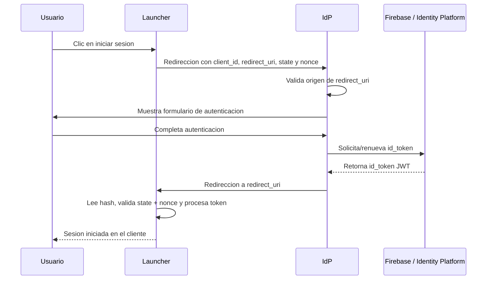

# Implementacion tecnica: Launcher hacia IdP y retorno al cliente

Esta guia describe como debe integrarse una aplicacion cliente, tambien llamada
**Launcher** o **Relying Party**, con el IdP del proyecto en el entorno actual de
pruebas.

El contrato vigente del producto es:

- IdP como SPA stateless sobre Firebase Auth / GCP Identity Platform.
- Flujo OIDC Implicit hacia las aplicaciones cliente.
- Inicio desde el Launcher mediante redireccion del navegador al IdP.
- Retorno al Launcher mediante `redirect_uri` con el resultado en el fragmento
  de URL (`#...`).
- Validacion estricta de `redirect_uri` contra `window.APP_CONFIG.allowedOrigins`.

No se debe cambiar este flujo a Authorization Code + PKCE ni a un backend OIDC
stateful sin un ADR nuevo y actualizacion de la arquitectura.

## 1. Componentes del entorno de pruebas

| Componente | Puerto local | Rol |
| --- | ---: | --- |
| Launcher / Mock Client | `http://localhost:3000` | Sitio que inicia el login y recibe el resultado. |
| IdP SPA | `http://localhost:5173` | Micrositio de autenticacion. |
| Firebase / Identity Platform | GCP | Valida la identidad y emite el `id_token`. |

Para levantar el entorno integrado:

```bash
pnpm install
pnpm run dev:simulation
```

El comando inicia el IdP con Vite y el Launcher de simulacion en paralelo.

## 2. Configuracion requerida

### 2.1 IdP

El IdP debe conocer que origenes pueden recibir tokens. En pruebas locales se
configura en `public/config.js`:

```javascript
window.APP_CONFIG = {
  allowedOrigins: [
    "http://localhost:3000",
    "http://localhost:5173"
  ],
  BACKEND_URL: "http://localhost:8080"
};
```

Regla de seguridad:

- El IdP compara el **origen** de `redirect_uri` contra `allowedOrigins`.
- Se permite `http://localhost:3000/cualquier/ruta` si el origen
  `http://localhost:3000` esta autorizado.
- Se bloquea cualquier dominio no listado antes de mostrar el login y antes de
  emitir token.

### 2.2 Launcher

El Launcher de pruebas lee el IdP desde `mock-client/public/config.js`:

```javascript
window.APP_CONFIG = {
  IDP_URL: "http://localhost:5173"
};
```

En una aplicacion cliente real se debe parametrizar por ambiente:

```javascript
const IDP_URL = "http://localhost:5173";
const CLIENT_ID = "launcher-pruebas";
const REDIRECT_URI = window.location.origin + "/auth/callback";
```

El valor de `REDIRECT_URI` debe pertenecer a un origen registrado en
`allowedOrigins` del IdP.

### 2.3 Firebase / GCP

Para pruebas locales, la API Key del proyecto GCP debe permitir:

- HTTP referrers:
  - `http://localhost:5173/*`
  - `http://localhost:3000/*`
  - `https://<PROJECT_ID>.firebaseapp.com/*`
- API restrictions:
  - `Identity Toolkit API`
  - `Token Service API`

Sin `Token Service API`, el login puede parecer exitoso pero el IdP no podra
obtener el `id_token` final.

## 3. Contrato de invocacion desde el Launcher

El Launcher inicia la autenticacion redirigiendo el navegador al IdP:

```text
{IDP_URL}/?client_id={CLIENT_ID}&redirect_uri={REDIRECT_URI_ENCODED}&response_type=id_token&scope=openid%20profile%20email&state={STATE_ALEATORIO}&nonce={NONCE_ALEATORIO}
```

Ejemplo local:

```text
http://localhost:5173/?client_id=mock-client-app&redirect_uri=http%3A%2F%2Flocalhost%3A3000&response_type=id_token&scope=openid%20profile%20email&state=login-m0ABC-...&nonce=nonce-m0ABC-...
```

Parametros:

| Parametro | Requerido | Descripcion |
| --- | --- | --- |
| `client_id` | Si | Identificador logico del Launcher. El IdP lo muestra como contexto de acceso. |
| `redirect_uri` | Si | URL del Launcher a la que debe volver el IdP. Su origen debe estar autorizado. |
| `response_type` | Recomendado | Usar `id_token` para dejar explicito el contrato OIDC implicit del entorno actual. |
| `scope` | Recomendado | Usar `openid profile email` cuando el cliente requiere contexto OIDC basico. |
| `state` | Recomendado | Valor opaco, aleatorio y de un solo intento generado por el Launcher para correlacionar solicitud y respuesta. No debe ser un valor fijo de configuracion. |
| `nonce` | Recomendado | Valor opaco, aleatorio y de un solo intento generado por el Launcher para asociar el retorno con la solicitud iniciada. No debe ser un valor fijo de configuracion. |
| `prompt` | Opcional | Usar `none` solo para renovacion silenciosa de token. |

El `redirect_uri` siempre debe enviarse con `encodeURIComponent`.

El Launcher debe guardar temporalmente el `state` y el `nonce` esperados
antes de redirigir al IdP. Al volver, debe comparar ambos valores contra el
fragmento de retorno y rechazar la respuesta si alguno no coincide. En esta SPA
stateless sobre Firebase, el IdP preserva el `nonce` como parametro de retorno
en el fragmento; emitirlo como claim dentro del `id_token` requeriria cambiar la
forma de emision del token y actualizar la arquitectura.

### 3.1 Parametros seguros de retorno del Launcher

El Launcher puede enviar parametros adicionales para correlacion operativa
(por ejemplo `trace=PAU14:56373:ew2h6q6y2u229`, `flow_id` o `channel`). El IdP
los devuelve en el mismo fragmento de retorno exitoso o fallido:

```text
{REDIRECT_URI}#id_token=<JWT>&state=<STATE>&nonce=<NONCE>&trace=PAU14%3A56373%3Aew2h6q6y2u229
```

Reglas aplicadas por el IdP antes de reflejar estos valores:

- No se reenvian parametros reservados OIDC/Firebase como `client_id`,
  `redirect_uri`, `state`, `scope`, `nonce`, `prompt`, `id_token`,
  `access_token`, `error`, `oobCode`, `mode` o `continueUrl`.
- El nombre debe iniciar por letra y solo puede contener letras, numeros, `_` o
  `-`, con maximo 40 caracteres.
- El valor debe tener entre 1 y 256 caracteres y solo puede contener letras,
  numeros, `:`, `.`, `_`, `~`, `@`, `/`, `+`, `,` o `-`.
- Si un parametro adicional no cumple las reglas, el IdP bloquea la solicitud
  antes de mostrar login.

Ejemplo para Launchers:

```javascript
const passthrough = new URLSearchParams(window.location.search);
for (const [name, value] of passthrough.entries()) {
  if (!isReservedOidcParam(name) && isSafePassthroughParam(name, value)) {
    authUrl.searchParams.append(name, value);
  }
}
```

El callback del Launcher debe leer estos parametros desde `window.location.hash`
porque el contrato de retorno vigente es OIDC implicit. Leerlos solo desde
`window.location.search` no cubre la respuesta real del IdP.

## 3.2 Login por enlace de correo (dos pestañas)

Cuando el usuario pide un enlace de acceso desde el IdP (pestaña A) y lo abre desde el
correo (pestaña B), el IdP coordina el retorno OIDC:

| Situación | Comportamiento |
| --- | --- |
| Pestaña A sigue abierta | B completa Firebase; **A** redirige a `redirect_uri#id_token=...`; B muestra mensaje para cerrar la pestaña. |
| Pestaña A cerrada | B redirige al partner (fallback tras ~3 s si no detecta A). |
| Otro dispositivo | B pide confirmar correo y luego redirige al partner. |

Desactivar coordinación (comportamiento legacy: solo B redirige):

```javascript
window.APP_CONFIG = {
  emailLinkPrimaryTabRedirect: false
};
```

Implementación: `src/utils/emailLinkTabCoordination.ts`, `PasswordlessLoginForm`, `EmailLinkActionForm`.

Auditoría del callback del partner: [PARTNER_OIDC_CALLBACK_AUDIT.md](./PARTNER_OIDC_CALLBACK_AUDIT.md).

## 4. Flujo exitoso



Resultado de exito:

```text
http://localhost:3000/#id_token=<JWT>&state=random_state_string&nonce=random_nonce_string
```

Responsabilidades del Launcher al recibir el retorno:

1. Leer `window.location.hash`.
2. Extraer `id_token`, `state` y `nonce`.
3. Comparar `state` contra el valor generado antes de redirigir al IdP.
4. Comparar `nonce` contra el valor generado antes de redirigir al IdP.
5. Validar el token segun la politica del cliente.
6. Crear la sesion local del Launcher.
7. Limpiar el fragmento de URL para no dejar el token visible en historial o UI.

Ejemplo minimo del Launcher:

```javascript
const hash = new URLSearchParams(window.location.hash.slice(1));
const idToken = hash.get("id_token");
const returnedState = hash.get("state");
const returnedNonce = hash.get("nonce");

if (
  idToken &&
  returnedState === sessionStorage.getItem("oidc_state") &&
  returnedNonce === sessionStorage.getItem("oidc_nonce")
) {
  sessionStorage.setItem("idp_token", idToken);
  window.history.replaceState(null, "", window.location.pathname);
}
```

## 5. Flujo fallido por autenticacion o sesion

En el login interactivo, los errores de credenciales o del enlace de acceso se
muestran dentro del IdP para que el usuario pueda corregir o solicitar un nuevo
intento.

En renovacion silenciosa con `prompt=none`, el IdP no muestra login. Si no hay
sesion activa, retorna al Launcher con error en el fragmento:

```text
http://localhost:3000/#error=login_required&error_description=Sesión%20no%20activa%20en%20el%20IdP&state=refresh&nonce=refresh_nonce
```

El Launcher debe interpretar `login_required` como una senal para iniciar login
interactivo o cerrar la sesion local.

## 6. Flujo bloqueado por `redirect_uri` no autorizado

Si el Launcher envia un `redirect_uri` cuyo origen no esta en `allowedOrigins`,
el IdP bloquea la solicitud:

```text
http://localhost:5173/?client_id=test&redirect_uri=https%3A%2F%2Fevil.example&response_type=id_token&state=abc
```

Comportamiento esperado:

- No se muestra el formulario de login.
- No se solicita autenticacion al usuario.
- No se emite `id_token`.
- Se muestra un error de seguridad en el IdP.

Este bloqueo evita que un sitio no confiable use el IdP para recibir tokens.

## 7. Renovacion silenciosa

Cuando el Launcher ya tiene un `id_token`, debe revisar el claim `exp`. Antes de
que expire, puede pedir un token fresco usando `prompt=none`:

```text
http://localhost:5173/?client_id=mock-client-app&redirect_uri=http%3A%2F%2Flocalhost%3A3000&response_type=id_token&scope=openid%20profile%20email&state=refresh&nonce=refresh_nonce&prompt=none
```

Resultados posibles:

| Resultado | Fragmento de retorno | Accion del Launcher |
| --- | --- | --- |
| Hay sesion activa en el IdP | `#id_token=<JWT>&state=refresh&nonce=...` | Validar `state` + `nonce` y reemplazar el token local. |
| No hay sesion activa | `#error=login_required&...&state=refresh&nonce=...` | Validar `state` + `nonce`; pedir login interactivo o cerrar sesion. |
| Error tecnico | `#error=server_error&...&state=refresh&nonce=...` | Validar `state` + `nonce`; mostrar mensaje controlado y permitir reintento. |

Recomendacion para pruebas: programar la renovacion 5 a 10 minutos antes de
`exp`.

## 8. Checklist para implementar un Launcher real

- Definir `client_id` por aplicacion cliente y ambiente.
- Definir `redirect_uri` exacto por ambiente.
- Solicitar que el origen del `redirect_uri` quede en `APP_CONFIG.allowedOrigins`.
- Generar un `state` aleatorio por intento de login y guardarlo temporalmente.
- Generar un `nonce` aleatorio por intento de login y guardarlo temporalmente.
- Construir la URL del IdP con `redirect_uri` codificado.
- Al volver, leer solo el fragmento `window.location.hash`.
- Validar que el `state` retornado coincida.
- Validar que el `nonce` retornado coincida.
- Procesar `id_token` sin escribirlo en logs.
- Limpiar el fragmento de URL despues de procesarlo.
- Manejar `login_required` y `server_error`.
- Implementar renovacion silenciosa solo si el cliente necesita mantener sesion.

## 9. Escenarios de prueba manual

### 9.1 Login exitoso

1. Ejecutar `pnpm run dev:simulation`.
2. Abrir `http://localhost:3000`.
3. Hacer clic en iniciar sesion.
4. Autenticarse en el IdP.
5. Verificar que el navegador vuelve a `http://localhost:3000`.
6. Confirmar que el Launcher recibe un JWT en `id_token` y muestra sus claims.

### 9.2 Retorno no autorizado

1. Abrir:

```text
http://localhost:5173/?client_id=test-client&redirect_uri=https%3A%2F%2Fevil.example&response_type=id_token&state=abc
```

2. Confirmar que el IdP muestra error de seguridad.
3. Confirmar que no se muestra el formulario de login.

### 9.3 Renovacion silenciosa sin sesion

1. Cerrar sesion o limpiar la sesion del navegador.
2. Abrir:

```text
http://localhost:5173/?client_id=mock-client-app&redirect_uri=http%3A%2F%2Flocalhost%3A3000&response_type=id_token&state=refresh&prompt=none
```

3. Confirmar retorno al Launcher con `error=login_required`.

## 10. Referencias en el repositorio

- `src/App.tsx`: lectura de parametros OIDC, validacion de `redirect_uri`,
  emision de `id_token` y `prompt=none`.
- `public/config.js`: `allowedOrigins` y configuracion runtime del IdP.
- `mock-client/index.html`: ejemplo de Launcher local.
- `mock-client/public/config.js`: `IDP_URL` del Launcher de pruebas.
- `docs/architecture/TECH_README.md`: arquitectura y flujos OIDC.
- `docs/architecture/decisions/0001-idp-spa-stateless-bff-stateful.md`:
  decision formal de mantener SPA stateless + OIDC Implicit.
